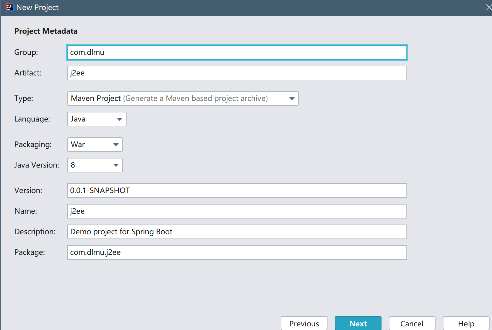
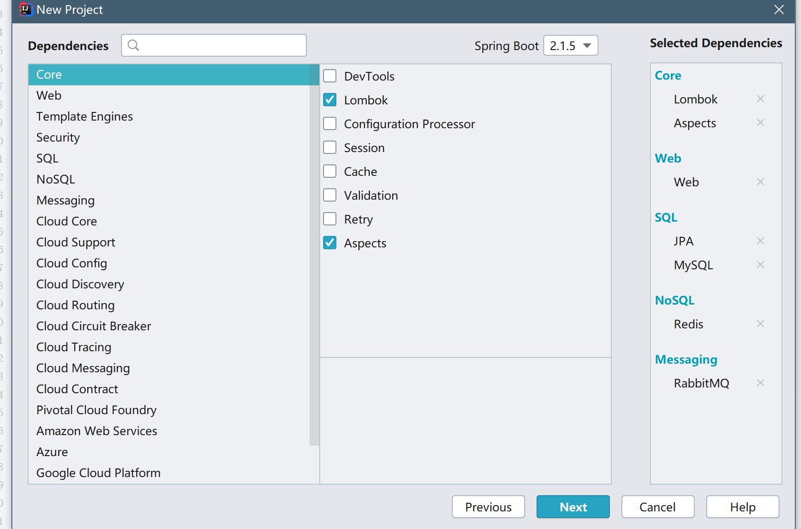
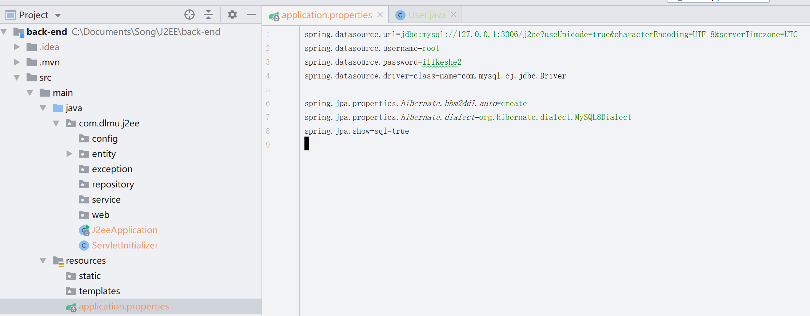
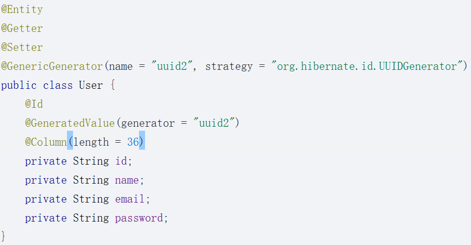
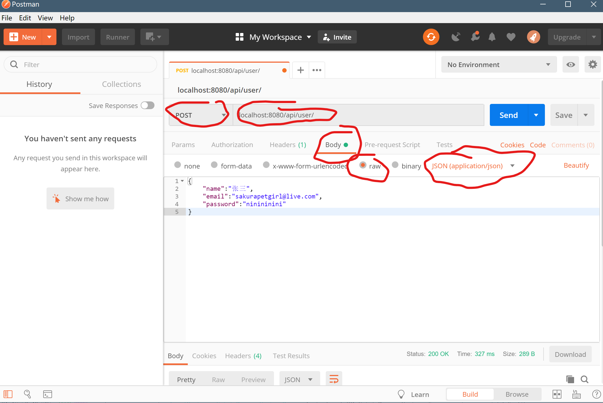
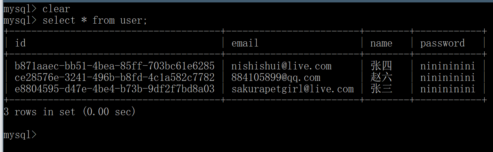
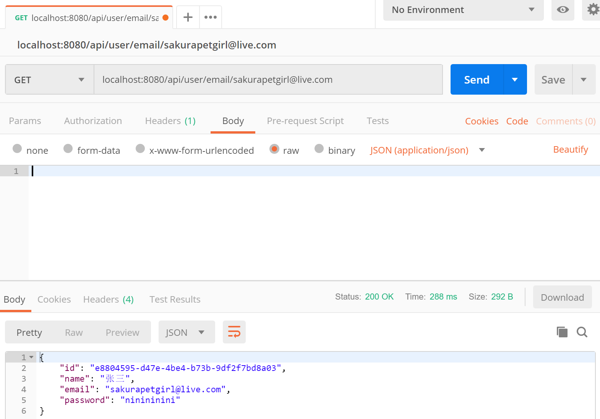
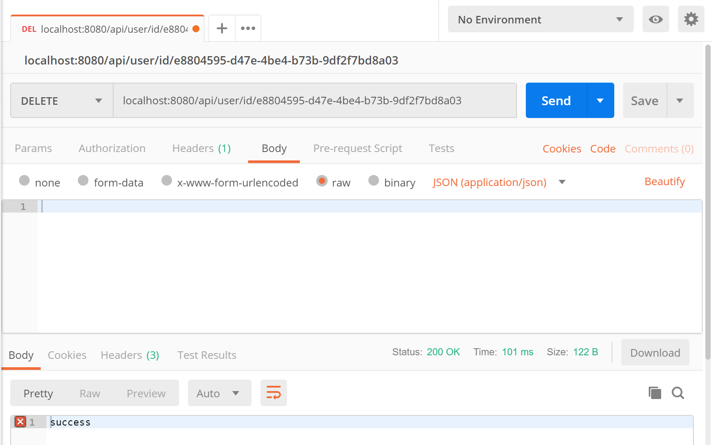
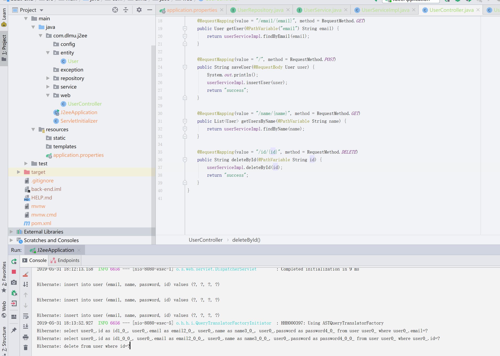

*J2EE作业23333顺便就写了吧,前后端似乎都有...就当作基础部分了,作为一个实验作业而言并没有什么难度可言...*

# Spring Data JPA

之前介绍spring的时候不是有提到过spring从最基础的依赖注入包发展到最后有了一系列的解决方案,其中spring data jpa就是一个数据库操作的解决方案,是一个完整的orm映射框架,不同于mybatis,它将整个数据库表直接就看作是一个类,每个数据都看作是一个新的对象...由于入门的话能少写很多类似mybatis那种查询语句一样的配置方案,所以j2ee我就用这个来搞定了...

首先创建项目



修改packaging为war,其它的按喜好就可以了



添加这些依赖,其中lombok是一个简化代码的工具,aspects就是面向切面aop编程,JPA就是spring data jpa,mysql是连接mysql的依赖包,redis是连接redis依赖包,redis是一个NoSql数据库,就是不需要编写sql语句,数据保存在内存而不是硬盘中,所以通常用来当作缓存的解决方案,rabbitmq是一个消息队列的工具,记得上学期操作系统应该讲过消息队列...用到的时候会再说一遍的~

下一步,然后finish.



在com.dlmu.j2ee包下创建config,repository,entity,exception,service,web包,其中config用来放配置类,repository用来放数据库的访问,service用来处理业务逻辑,exception是异常处理,web用来放控制器.

然后打开application.properties输入数据库配置和jpa的配置.

```properties
spring.datasource.url=jdbc:mysql://127.0.0.1:3306/j2ee?useUnicode=true&characterEncoding=UTF-8&serverTimezone=UTC
spring.datasource.username=root
spring.datasource.password=ilikeshe2
spring.datasource.driver-class-name=com.mysql.cj.jdbc.Driver

# 该设置有四个属性,常用的是create,update,create-drop
# create是自动根据entity来在数据库中创建表,如果已经存在该表,就会drop然后重新创建
# update是如果已经存在该表,会对比entity中的属性来更新表的设置
# create-drop是运行程序时创建表,停止服务时删除表.
spring.jpa.properties.hibernate.hbm2ddl.auto=create
# 方言,因为每个数据库,比如mysql,sqlserver,oracle等都有不同的特性,而jpa根据不同的数据库底层有不同的实现,方言就是告诉jpa到底使用哪一个实现.
spring.jpa.properties.hibernate.dialect=org.hibernate.dialect.MySQL8Dialect
# 运行时显示sql语句,方便debug的.
spring.jpa.show-sql=true
```

现在编写个User实体.

```java
//声明该类为实体类,即对应数据库中的table..学数据库的时候所谓的实体关系模型就是Entity-Relationship-model,这里的entity就是所谓的数据库中的实体了
@Entity
//自动生成数据的策略,strategy是指使用什么方式,比如自增长1,或者我现在用的使用hibernate提供的id生成算法
//name跟下面的generator对应就ok
//uuid是根据一系列算法算出来的长度为32位的一个字符串,然后其中有4个-连接,所以总共36个长度
@GenericGenerator(name = "uuid2", strategy = "org.hibernate.id.UUIDGenerator")
public class User {
    @Id
    //id标签表明该表的primary key
    @GeneratedValue(generator = "uuid2")
    @Column(length = 36)
    private String id;
    private String name;
    private String email;
    private String password;
}
```

然后是编写getter和setter,这时候我们之前添加的lombok就派上用处了,编写很多getter和setter又没什么意义,单纯的只是体现了java的封装特性而已,而lombok则利用反射帮我们自动给类上的所有属性增加getter和setter方法,只要在类上增加@Getter和Setter标签就可以了.



完整代码如图...这样就可以了,然后我们编写repository,在repository里新建UserRepository接口,继承JPARepository就可以,代码如下

```java
package com.dlmu.j2ee.repository;

import com.dlmu.j2ee.entity.User;
import org.springframework.data.jpa.repository.JpaRepository;

public interface UserRepository extends JpaRepository<User,String> {
    User findByEmail(String email);
}
```

其中JpaRepository<User,String>后面的那个泛型,表示我们存放的数据类型是User,Id的类型是String.

然后编写的findByEmail,它会自动帮我们解析成select * from user where email = email这样子的sql语句,如果你要通过name进行模糊查询,你可以直接编写

```java
List<User> findByNameLike(String name);
```


类似这样子的方法,jpa会解析成select * from user where name like name这样子的sql语句

所以完整的repository我们先写成这样子

```java
public interface UserRepository extends JpaRepository<User,String> {
    User findByEmail(String email);
    List<User> findByNameLike(String name);
}
```


然后可以编写service了,创建一个UserService接口

```java
public interface UserService {
    User findByEmail(String email);
    List<User> findByName(String name);
    void insertUser(User user);
    void deleteById(String id);
    void updateUser(User user);
}
```

然后再在service包下创建impl包,表示里面存放我们的service接口实现类,然后创建UserServiceImpl类

```java
@Service
//首先打上Service标签,作用跟Component完全相同,就是单纯的语义化了一些,就像是说这个类是一个Service类型的Component.
public class UserServiceImpl implements UserService {
    //final,表示该对象引用不能改变.
    private final UserRepository userRepository;
	//注入userRepository,使用的时候只需要@Autowired,spring会自动帮我们注入repository.
    //等同于@Autowired UserRepository userRepository,不过使用构造器注入更...等我知道为什么了再写...
    //目前我不用之前的注入方式就只是单纯的idea不想让我那么做,会有黄色警告...
    public UserServiceImpl(UserRepository userRepository) {
        this.userRepository = userRepository;
    }

    @Override
    public User findByEmail(String email) {
        return userRepository.findByEmail(email);
    }

    @Override
    public List<User> findByName(String name) {
        return userRepository.findByNameLike(name);
    }

    @Override
    public void insertUser(User user) {
        userRepository.save(user);
    }

    @Override
    public void deleteById(String id) {
        userRepository.deleteById(id);
    }

    @Override
    public void updateUser(User user) {
        userRepository.save(user);
    }
}
```

代码都是很简单的,因为我们的repository继承了jparepository,所以就可以使用默认的很多方法,比如deleteById,或者save,而save的实现里面有判断是否存在该数据的逻辑的,如果存在就是更新,不存在就是insert,所以这两个方法我们都只是用save就够了.

然后就只剩最后一个工作了,编写controller~

```java
@RestController
//RestController标签是Controller标签和ResponseBody标签的结合,ResponseBody标签的作用是让所有的方法返回值都自动转为JSON字符串
//该类下所有的方法请求地址都为/api/user
@RequestMapping("/api/user")
public class UserController {
    private final UserService userServiceImpl;

    public UserController(UserService userServiceImpl) {
        this.userServiceImpl = userServiceImpl;
    }
	//请求地址为/{email},方法为get的时候调用该方法返回响应
    //PathVariable对应的就是{email},其中两种对应的方法,要么变量名命名和{email}中的email对应,要么
    //PathVariable中的value跟{email}对应
    @RequestMapping(value = "/email/{email}", method = RequestMethod.GET)
    public User getUser(@PathVariable("email") String myEmail) {
        return userServiceImpl.findByEmail(myEmail);
    }
	//方法为POST的时候调用该方法
    //@RequestBody方法会自动把请求体中的数据转为对象,如果转换失败会报类型错误的异常
    @RequestMapping(value = "/", method = RequestMethod.POST)
    public String saveUser(@RequestBody User user) {
        System.out.println();
        userServiceImpl.insertUser(user);
        return "success";
    }
	//这里的就是{name}和@PathVariable标签的变量名命名相同
    @RequestMapping(value = "/name/{name}", method = RequestMethod.GET)
    public List<User> getUsersByName(@PathVariable String name) {
        return userServiceImpl.findByName(name);
    }
	
    @RequestMapping(value = "/id/{id}", method = RequestMethod.DELETE)
    public String deleteById(@PathVariable String id) {
        userServiceImpl.deleteById(id);
        return "success";
    }
}
```

一个简单的增删改查Controller就这么编写完成了~我们使用postman软件进行模拟请求,来看一下对不对吧~

首先创建一个用户吧,打开postman



首先请求方法为POST,请求地址是localhost:8080/api/user/

然后编写请求体内容,点击body,点击raw,点击json,表明我们请求的内容体为json字符串类型.

请求体就是前端向后端发送请求时候携带的内容,因为我们没有前端,所以用postman来模拟那些内容.

我给你下载postman了吧...

然后点击send

应该可以看到下方返回了success,我们多send几个用户吧~修改修改name和email然后send,在数据库中看看我们的数据吧~



可以看到我们成功创建了三条数据~id根据我们的配置自动生成了36个字符长度的uuid然后测试下根据Email查询的那个方法.



请求改为post,然后访问localhost:8080/api/user/email/sakurapetgirl@live.com

send后发现成功返回了我们的张三~我们再根据这个id把张三删除掉吧~



然后再看看数据库中的数据


张三已经被删除掉了~

我们也可以在idea控制台中看到我们的sql语句



剩下的你有兴趣重新测试吧~

接下来我要编写其他内容了,比如密码加密,权限管理之类的~会每步详细说明的...不过可能我会删掉一些写好的代码...不过你都可以从commit历史中看到我写过的代码...歇会再写...一个周末应该能把前后端都写完..毕竟下周交作业..我还得准备考四级和高数...哭唧唧......


## 总结

说明下Spring data JPA吧...

JPA是一个规范性质的接口,全称Java Persistence API,是SUN公司(发布java的公司)提供的规范,第三方框架开发者可以根据这一系列接口的要求来进行底层实现.

之前也大致了解了面向接口编程...好处就是开发者不需要知道底层实现是什么,只需要使用这些实现公共的接口就可以使用了...比如说连接数据库的接口,定义这样一个接口

```java
public interface SqlConnection{
    void connect();
    void close();
}
```

而不同的数据库比如MySql,SQLServer,Oracle,Redis,MongoDB,使用java连接它们的方式是不一样的.

所以框架开发者可以在底层根据不同的数据库来编写不同的实现.

最终使用的时候不管你连接的是MySql,还是SQLServer,还是Redis,都只需要使用SqlConnection接口中的那两个方法就可以了,只要你告诉框架开发者你使用的是哪个数据库就可以了...

在之前的配置里我们不是配置过Dialect么?就相当于是这个作用了.

然后是Spring data JPA,就是spring和JPA的一个整合,spring默认底层使用的是Hibernate,现在java最流行的两个ORM框架就是Hibernate和Mybatis了,Mybatis在之前已经有所了解过了.

Mybatis可以根据表来自动生成简单的增删改查Mapper

而Spring data JPA则是根据Java类来生成表.

Mybatis需要手动编写SQL语句,如果你对SQL语句熟悉的话,可能Mybatis上手会更快,而SpringDataJPA则需要你再记一些接口和规范,反之不需要编写SQL语句.

比如我们之前继承了JpaRepository的仓库,里面的方法名称是有规范的,JPA底层有个实现是解析方法名称,然后将方法名称生成为SQL语句...这里列出一些常见的规范吧

| 关键字            | 示例                                                    | SQL表达                                   |
| ----------------- | :------------------------------------------------------ | ----------------------------------------- |
| And               | findByLastnameAndFirstname                              | ...Where x.lastname=? and x.firstname=?   |
| Or                | findByLastnameOrFirstname                               | ...where x.lastname=? or x.firstname=?    |
| Is,Equals         | findByFirstname,findByFirstnameIs,findByFirstnameEquals | ...where x.firstname=?                    |
| Between           | findByStartDateBetween                                  | ...where x.startDate between ? and ?      |
| LessThen          | findByAgeLessThan                                       | ...where x.age<?                          |
| LessThanEqual     | findByAgeLessThanEqual                                  | ...where x.age<=?                         |
| GreaterThan       | ...                                                     | ...                                       |
| GreaterThanEqual  | ...                                                     | ...                                       |
| After             | findByDateAfter                                         | ...where x.date>?                         |
| Before            | findByDateBefore                                        | ...where x.date<?                         |
| IsNull            | findByAgeIsNull                                         | ...where x.age is null                    |
| IsNotNull,NotNull | findByAgeNotNull                                        | ...where x.age not null                   |
| Like              | findByNameLike                                          | ...where x.name like ?                    |
| NotLike           | findByNameNotLike                                       | ...where x.name not like?                 |
| StartingWith      | findByNameStartingWith                                  | 参考like,参数前被通配符%包裹              |
| EndingWith        | findByNameStartingWith                                  | 参考like,参数后被通配符%包裹              |
| Containing        | findByFirstnameContaining                               | 参考like,参数前后被通配符%包裹            |
| OrderBy           | findByAgeOrderByLastnameDesc                            | ...where x.age=? order by x.lastname desc |
| Not               | findByAgeNot                                            | ...where x.age <> ?                       |
| In                | ...                                                     | ...                                       |
| NotIn             | findByAgeNotIn(Collection<Age> ages)                    | ...where x.age not in ?                   |
| True              | findByActiveTrue                                        | ...where x.active = true                  |
| Flase             | findByActiveFalse                                       | ...where x.active = false                 |

基本上常见的查询方法都有,同时也支持分页查询,在以后用到了再写吧...

只要根据这些命名规范在Repository里编写方法名,然后就可以在Service中使用Repository中的方法来对数据库进行操作了...

默认的有几个实现,应该是save(),findById().其中findById()返回的是一个optional容器...这个容器写完这个项目会介绍一下,还有java的lambda编程...

不过总之...这些只不过是记忆性的东西,需要自己手动敲了,然后亲自看看效果,才能有更好的记忆,并没有什么难度上的东西...不过写这些总比写测试有趣些...

并没有什么难度...如果能看到这里...希望坚持看下去吧~