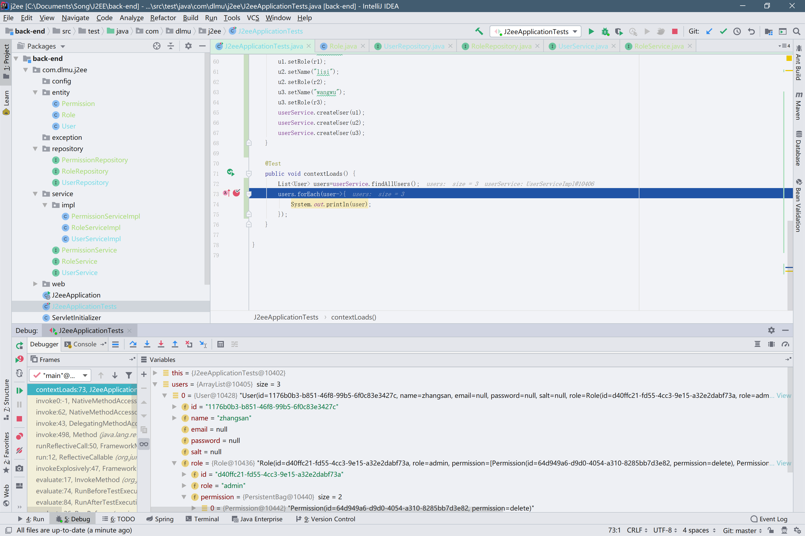

*一步步完善吧~接下来我们首先设计表的结构*

# 实体对象结构

要设计表结构,我们只需要设计好实体对象就行了,该j2ee作业时一个人力资源管理系统,因为在东软实习了那么几天,我们大致参考下它的管理系统吧...

首先我们需要设计用户表,内容设置如下

```java
@Entity
@Getter
@Setter
@ToString
@GenericGenerator(name = "uuid2", strategy = "org.hibernate.id.UUIDGenerator")
public class User {
    @Id
    @GeneratedValue(generator = "uuid2")
    @Column(length = 36)
    private String id;
    private String name;
    private String email;
    private String password;
    private String salt;
}
```

其中Setter,Getter,ToString都是lombok的东西,它会帮我们给该类添加这三个方法...但是每次都添加三个注解有点麻烦...这三个都是很常用的,所以lombok又有一个注解Data,相当于多个注解的结合,所以我们只需要打这个注解就可以了~修改如下

```java
package com.dlmu.j2ee.entity;

import lombok.Data;
import org.hibernate.annotations.GenericGenerator;

import javax.persistence.Column;
import javax.persistence.Entity;
import javax.persistence.GeneratedValue;
import javax.persistence.Id;

@Entity
@Data
@GenericGenerator(name = "uuid2", strategy = "org.hibernate.id.UUIDGenerator")
public class User {
    @Id
    @GeneratedValue(generator = "uuid2")
    //name表示在表中的列名,如果不设置默认就是变量名的小驼峰用_隔开,比如lastName在表中列名会是last_name
    @Column(length = 36, name = "user_id")
    private String id;
    private String name;
    //unique表示值唯一,表中不能重复
    @Column(unique = true)
    private String email;
    private String password;
    private String salt;
}
```

其中salt是用来对密码进行加密用的,所谓的加盐~后面介绍...

然后是一个角色类,就是说该对象是一个什么角色,是管理员?普通员工?老板?还是什么别的,然后根据角色分配不同的权限,所以我们再创建两个类,分别是Role,Permission代表着角色和权限,内容如下

Role:

```java
@Entity
@Data
@GenericGenerator(name = "uuid2", strategy = "org.hibernate.id.UUIDGenerator")
public class Role {
    @Id
    @GeneratedValue(generator = "uuid2")
    @Column(length = 36, name = "role_id")
    private String id;
    @Column(unique = true)
    private String role;
}
```

Permission:

```java
@Entity
@Data
@GenericGenerator(name = "uuid2",strategy = "org.hibernate.id.UUIDGenerator")
public class Permission {
    @Id
    @GeneratedValue(generator = "uuid2")
    @Column(length = 36,name = "permission_id")
    private String id;
    @Column(unique = true)
    private String permission;
}
```

然后设计对应关系...

在数据库中我们学习过一对一,一对多,多对一,多对多这四种对应关系,同样的,JPA提供给了我们四个注解,分别是

@OneToOne,@OneToMany,@ManyToOne,@ManyToMany

一个User可能有一个Role,而一个Role可能有多个Permission,同样的,一个Role可能有多个User,一个权限也可能有多个Role.

在查询的时候我们通常会在User类的实例对象查看它的角色,然后根据角色查看它所拥有的权限,所以User表和Role表是一对一,Role和Permission是多对多,而Role对User是一对多.所以我们修改该三个对象.如下

User:

```java
@Entity
@Data
@GenericGenerator(name = "uuid2", strategy = "org.hibernate.id.UUIDGenerator")
public class User {
    @Id
    @GeneratedValue(generator = "uuid2")
    @Column(length = 36, name = "user_id")
    private String id;
    private String name;
    @Column(unique = true)
    private String email;
    private String password;
    private String salt;
    //OneToOne会自动设置该表的外键为对应表的主键,如果你想自定义的话,使用@JoinColumn注解可以自定义外键
    @OneToOne
    private Role role;
}
```

Role:

```java
@Entity
@Data
@GenericGenerator(name = "uuid2", strategy = "org.hibernate.id.UUIDGenerator")
public class Role {
    @Id
    @GeneratedValue(generator = "uuid2")
    @Column(length = 36, name = "role_id")
    private String id;
    @Column(unique = true)
    private String role;
    //因为是多对多,所以我们用一个List来存放多个Permission.
    @ManyToMany
    private List<Permission> permission;
}
```

Permission就不做修改了...一般情况我们不会从Permission表中查询角色和用户吧~

然后运行程序,然后在MySql中看看给我们生成的表结构.


我们可以在控制台中看到创建表的语句,然后在mysql里使用desc命令来检查下.


虽然我们只有三个类,但是为什么生成了四个表?

一对一映射的话只需要有一个外键就可以了,而涉及到多个映射的话,就需要有一个中间表,可以看到在role到permission的一对多映射中自动帮我们生成了一个role_permission表.

然后我们编写对应的仓库,即Repository,编写如下三个Repository.

PermissionRepository:

```java
package com.dlmu.j2ee.repository;

import com.dlmu.j2ee.entity.Permission;
import org.springframework.data.jpa.repository.JpaRepository;

public interface PermissionRepository extends JpaRepository<Permission, String> {
}
```

UserRepository:

```java
package com.dlmu.j2ee.repository;

import com.dlmu.j2ee.entity.User;
import org.springframework.data.jpa.repository.JpaRepository;

public interface UserRepository extends JpaRepository<User, String> {
    User findByEmail(String email);
}
```

RoleRepository:

```java
package com.dlmu.j2ee.repository;

import com.dlmu.j2ee.entity.Role;
import org.springframework.data.jpa.repository.JpaRepository;

public interface RoleRepository extends JpaRepository<Role, String> {
}
```

然后编写Service

UserService:

```java
package com.dlmu.j2ee.service;

import com.dlmu.j2ee.entity.User;

import java.util.List;

public interface UserService {
    User findByEmail(String email);
    List<User> findAllUsers();
    void createUser(User user);
    boolean updateUser(User user);
}
```

RoleService:

``` java
package com.dlmu.j2ee.service;

import com.dlmu.j2ee.entity.Permission;
import com.dlmu.j2ee.entity.Role;

import java.util.List;

public interface RoleService {
    List<Permission> findRoleAllPermission(String id);
    void createRole(Role role);
}
```

PermissionService:

``` java
package com.dlmu.j2ee.service;

import com.dlmu.j2ee.entity.Permission;

import java.util.List;

public interface PermissionService {
    void createPermission(Permission permission);
    List<Permission> findAllPermission();
}
```

然后是对应的三个实现类

``` java
package com.dlmu.j2ee.service.impl;

import com.dlmu.j2ee.entity.User;
import com.dlmu.j2ee.repository.UserRepository;
import com.dlmu.j2ee.service.UserService;
import org.springframework.beans.factory.annotation.Autowired;
import org.springframework.stereotype.Service;

import java.util.List;

@Service
public class UserServiceImpl implements UserService {
    private final UserRepository userRepository;

    public UserServiceImpl(UserRepository userRepository) {
        this.userRepository = userRepository;
    }

    @Override
    public User findByEmail(String email) {
        return userRepository.findByEmail(email);
    }

    @Override
    public List<User> findAllUsers() {
        return userRepository.findAll();
    }

    @Override
    public void createUser(User user) {
        userRepository.save(user);
    }

    @Override
    public boolean updateUser(User user) {
        if (userRepository.findById(user.getId()).isPresent()) {
            userRepository.save(user);
            return true;
        } else {
            return false;
        }
    }

}

```

Role:

```java
package com.dlmu.j2ee.service.impl;

import com.dlmu.j2ee.entity.Permission;
import com.dlmu.j2ee.entity.Role;
import com.dlmu.j2ee.repository.RoleRepository;
import com.dlmu.j2ee.service.RoleService;
import org.springframework.beans.factory.annotation.Autowired;
import org.springframework.stereotype.Service;

import java.util.List;
import java.util.Optional;

@Service
public class RoleServiceImpl implements RoleService {
    private final RoleRepository repository;

    public RoleServiceImpl(RoleRepository repository) {
        this.repository = repository;
    }

    @Override
    public List<Permission> findRoleAllPermission(String id) {
        Optional<Role> role = repository.findById(id);
        //这个是lambda表达式,后面对单独提出一个篇章讲,现在大概知道这样子就可以了~
        return role.map(Role::getPermission).orElse(null);
    }

    @Override
    public void createRole(Role role) {
        repository.save(role);
    }
}

```

Permission:

```java
package com.dlmu.j2ee.service.impl;

import com.dlmu.j2ee.entity.Permission;
import com.dlmu.j2ee.repository.PermissionRepository;
import com.dlmu.j2ee.service.PermissionService;
import org.springframework.beans.factory.annotation.Autowired;
import org.springframework.stereotype.Service;

import java.util.List;

@Service
public class PermissionServiceImpl implements PermissionService {
    private final PermissionRepository repository;

    public PermissionServiceImpl(PermissionRepository permissionRepository) {
        this.repository = permissionRepository;
    }

    @Override
    public void createPermission(Permission permission) {
        repository.save(permission);
    }

    @Override
    public List<Permission> findAllPermission() {
        return repository.findAll();
    }
}

```

然后我们编写测试类,看看这三个是否好用~

```java
package com.dlmu.j2ee;

@RunWith(SpringRunner.class)
@SpringBootTest
public class J2eeApplicationTests {

    @Autowired
    RoleService roleService;
    @Autowired
    UserService userService;
    @Autowired
    PermissionService perService;

    @Before
    public void insertData() {
        Permission p1 = new Permission();
        p1.setPermission("create");
        Permission p2 = new Permission();
        p2.setPermission("delete");
        Permission p3 = new Permission();
        p3.setPermission("edit");
        perService.createPermission(p1);
        perService.createPermission(p2);
        perService.createPermission(p3);
        List<Permission> list1 = Arrays.asList(p1, p2);
        List<Permission> list2 = Arrays.asList(p2, p3);
        Role r1 = new Role();
        r1.setRole("admin");
        r1.setPermission(list1);
        Role r2 = new Role();
        r2.setRole("employee");
        r1.setPermission(list2);
        Role r3 = new Role();
        r3.setPermission(list1);
        r3.setRole("boss");
        roleService.createRole(r1);
        roleService.createRole(r2);
        roleService.createRole(r3);
        User u1 = new User();
        User u2 = new User();
        User u3 = new User();
        u1.setName("zhangsan");
        u1.setRole(r1);
        u2.setName("lisi");
        u2.setRole(r2);
        u3.setName("wangwu");
        u3.setRole(r3);
        userService.createUser(u1);
        userService.createUser(u2);
        userService.createUser(u3);
    }

    @Test
    public void contextLoads() {
        List<User> users=userService.findAllUsers();
        users.forEach(user->{
            System.out.println(user.toString());
        });
    }
}

```

首先我们使用@Before注解在进行测试前先进行数据的插入,然后我们在在users.forEach处打个断点,运行下Debug模式看看~


点击画圈处打个断点先


点击画圈处,以debug模式运行Test


可以看到我们已经成功查询到数据了,但是为什么会有报错呢?

我们可以观察到有两种类型的错误,其中一个是LazyInitializationException(),还有一个是toString()出错.

Lazy即懒加载,也就是说在查询数据的时候,如果是一对多的话,默认是不查询的,等你使用service再次查询的时候才能查询到懒加载的数据...懒加载是优化性能的一个方案,目前我们不需要该优化方案,所以我们修改一下刚才写的ManyToMany改为如下

```java
@ManyToMany(fetch = FetchType.EAGER)
private List<Permission> permission;
```

EAGER就是即时加载,我们再运行下测试看看~



可以看到一个role有多个permission了吧~很方便吧~

然后详细说明一下四个对应关系...

OneToOne,ManyToOne默认是EAGER

ManyToMany,OneToMany默认是LAZY

在你不需要那么多数据的时候其实lazy更好一点,不过权限和角色是我们通常还是与User绑定着用的,所以使用EAGER可能更好点23333

这个文档就写这些吧~后续见下一篇文档吧~