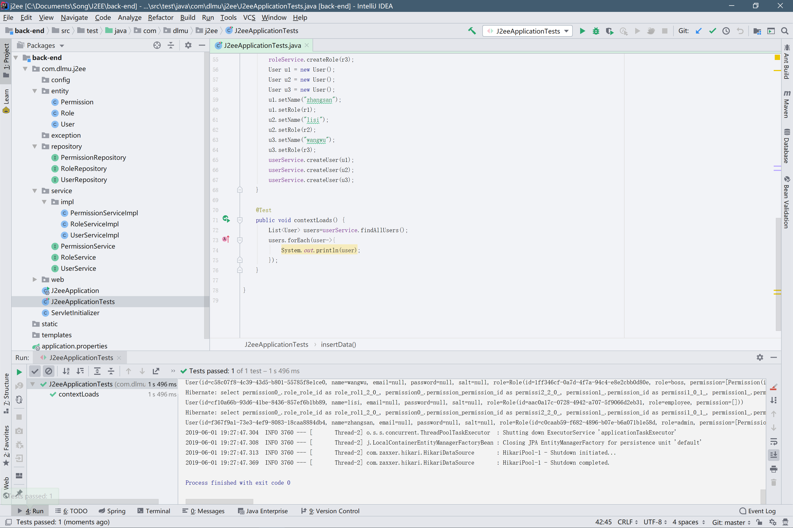

首先回顾下上篇文档最后把懒加载改为了即时加载,但我们还想用懒加载怎么办?

我们之前运行程序可能会有一个warning,是关于open-in-view的,那么这个warning是怎么回事?

其实是跟session相关的,默认是true

```properties
spring.jpa.open-in-view=true
```

实际的作用就是说,在一个controller请求完成之前,都只会由一个session进行处理,所以实际上我们的懒加载异常只会在测试repository和service时候出现,在测试controller的时候是不会出现的.而出现这个warning是因为spring希望我们显式地告诉它到底是true还是false,我们把这句加到application.properties后面.

懒加载出现问题是因为我们想获取懒加载的数据时候,因为数据库查询的session已经close()了,所以不能在需要的时候再进行sql语句查询,不过我们可以通过配置事务...

什么是事务?在数据库中学习过,事务是数据库中的内容,其中事务有四个特性,分别是

1. 原子性:是指事务包含的所有操作要么全部成功，要么全部失败回滚
2. 一致性:一个事务执行之前和执行之后都必须处于一致性状态。拿转账来说，假设用户A和用户B两者的钱加起来一共是5000，那么不管A和B之间如何转账，转几次账，事务结束后两个用户的钱相加起来应该还得是5000，这就是事务的一致性。
3. 隔离性:是当多个用户并发访问数据库时，比如操作同一张表时，数据库为每一个用户开启的事务，不能被其他事务的操作所干扰，多个并发事务之间要相互隔离。
4. 持久性:一个事务一旦被提交了，那么对数据库中的数据的改变就是永久性的，即便是在数据库系统遇到故障的情况下也不会丢失提交事务的操作。

所以当我们把查询放到一个事务里的时候,它实际上就只会用到一个session,在这个session里面所有的操作全部做完之后才会close(),使用事务的注解是@Transctional,打在方法上就可以了,比如在@Test单元测试的方法上打上该注解...

如果我们不想使用事务同时,又想使用懒加载,可以在application.properties中添加该配置

```properties
spring.jpa.properties.hibernate.enable_lazy_load_no_trans=true
```

然后把Role里面的ManyToMany中的内容删掉,默认为LAZY加载

然后重新运行测试~应该没有异常了



然后是关于懒加载优化的问题...随后会在需要的时候更新...

目前我们功能还没写完,就不考虑那么多了~

接下来是考虑我们实际上需要什么功能,以及使用shiro框架进行权限管理和密码的加密处理.

