*感觉直接写j2ee部分有些...不明所以的...因为所有的新框架什么的都是基于最原始的servlet,相当于上学期使用的ASP.NET...所以还是先简单学习一下使用servlet如何创建一个程序吧*

# Servlet

## Tomcat

Tomcat是一个java应用程序,它的类别的java服务器程序,和servlet容器程序...

也就是说它的作用是提供java服务和容纳servlet在它里面运行...就是这样...

要说什么是容器...就是装东西的瓶子...比如说ArrayList&lt;String&gt;是一个容纳String的动态数组容器.

Tomcat就是一个Tomcat&lt;Servlet&gt;容纳Servlet的容器.

可以认为,Tomcat使用java提供的网络编程的接口,来实现了一个响应web请求的应用程序.回头会看看tomcat的源码...简单写一个自己的小型Tomcat应用...同样的也会简单写一个Servlet,Spring,Spring-MVC框架...

## Servlet

### HelloWorld Servlet应用

Servlet是Java EE提供的一套接口规范,你只要根据它接口的信息进行编程,就可以编写Web应用程序.

打开IDEA,创建一个Java Enterprise项目,从里面找到Web Application

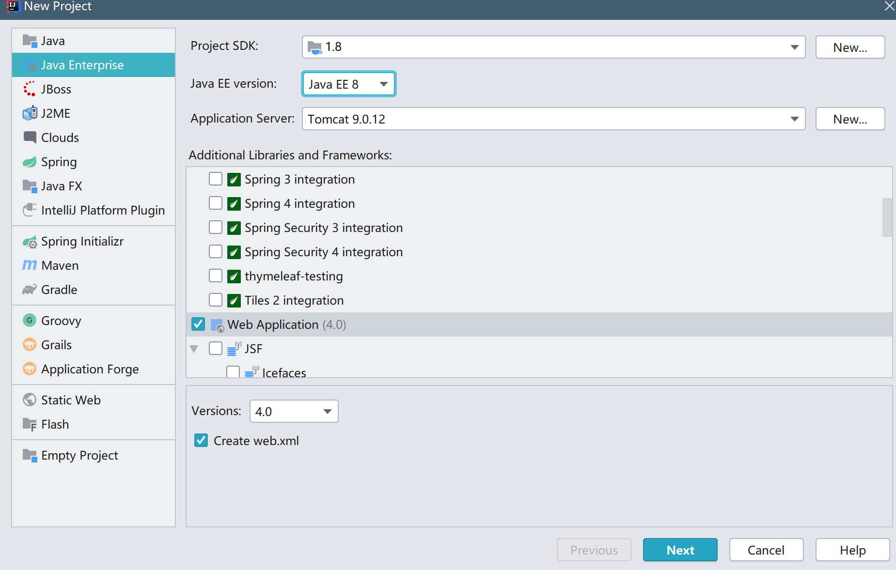

一直下一步就可以了,项目结构如图

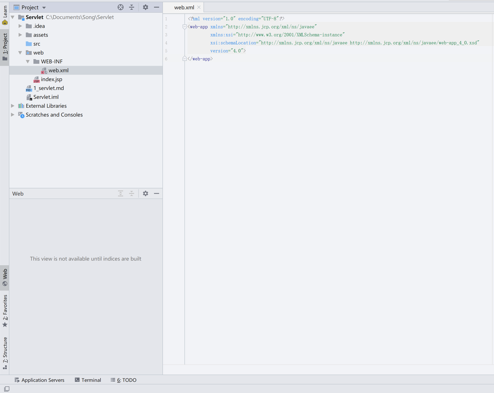

我们在src目录下创建一个HelloServlet,内容如下

```java
import javax.servlet.http.HttpServlet;
import javax.servlet.http.HttpServletRequest;
import javax.servlet.http.HttpServletResponse;
import java.io.IOException;
import java.util.Date;

public class HelloServlet extends HttpServlet {
    @Override
    public void doGet(HttpServletRequest request, HttpServletResponse response){
        try{
            response.getWriter().println("<h1>Hello Servlet</h1>");
            response.getWriter().println(new Date());
        } catch (IOException e) {
            e.printStackTrace();
        }
    }
}
```

然后打开web.xml文件,在web-app中添加如下内容

```xml
<servlet>
    <servlet-name>HelloServlet</servlet-name>
    <servlet-class>HelloServlet</servlet-class>
</servlet>
<servlet-mapping>
    <servlet-name>HelloServlet</servlet-name>
    <url-pattern>/hello</url-pattern>
</servlet-mapping>
```

长这个样子

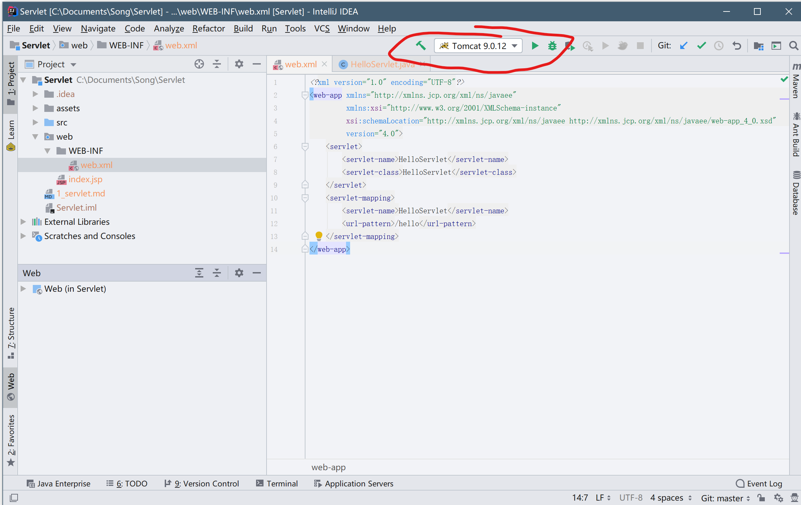

点击画圈部分的运行,启动tomcat服务器,会自动打开浏览器访问一个localhost:8080/Servlet_war_exploded的地址,我们在后面加上/hello,可以看到显示结果如图

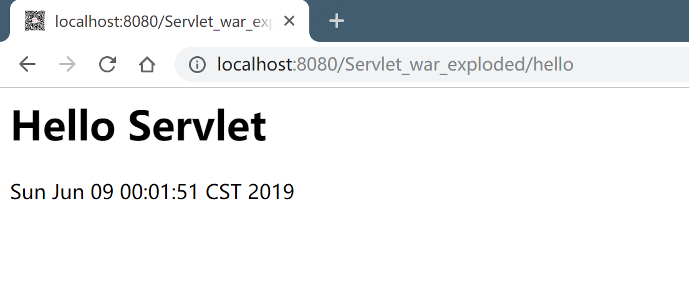

不过有个/Servlet_war_explode/这样的东西,看着挺烦的...我们修改一下tomcat服务器的配置...

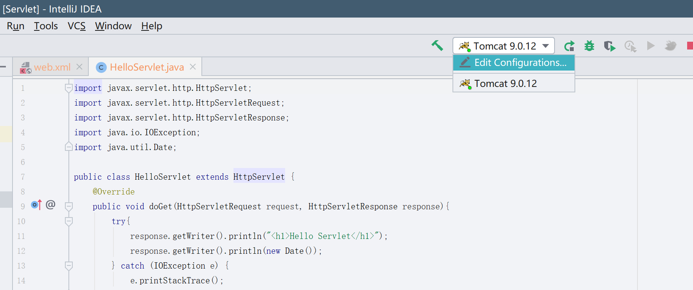

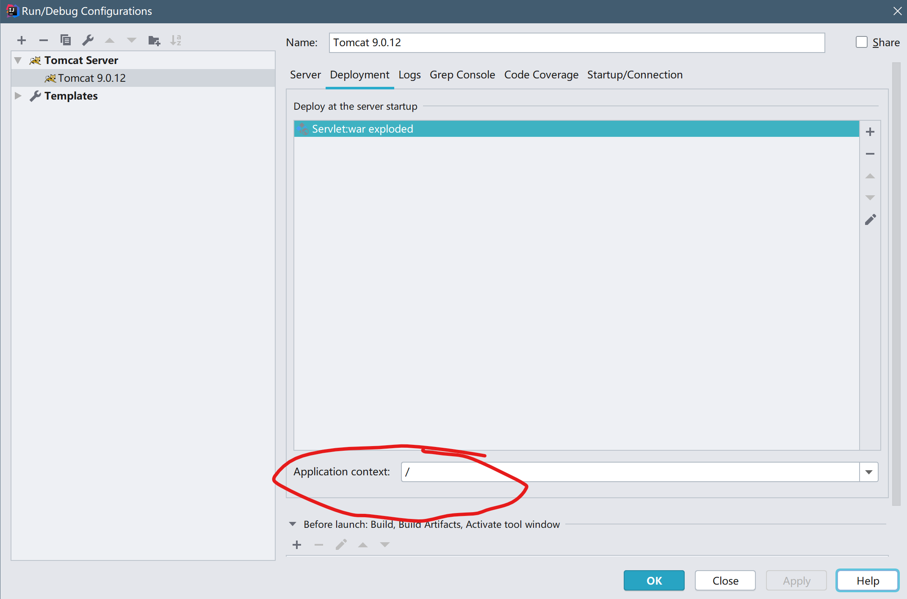

画圈部分内容删掉只剩一个/就可以了

然后我们只需要访问localhost:8080/hello就可以了现在~

现在我们看看代码中的内容.

```java
@Override
public void doGet(HttpServletRequest request, HttpServletResponse response){
    try{
        response.getWriter().println("<h1>Hello Servlet</h1>");
        response.getWriter().println(new Date());
    } catch (IOException e) 
        e.printStackTrace();
    }
}
```

@Override注解之前说明过,表明这个方法是重写了父类中已经存在的方法.

request是请求,Tomcat会解析http请求头部,然后包装成一个Request对象,我们可以通过request对象访问到有关请求的所有信息...

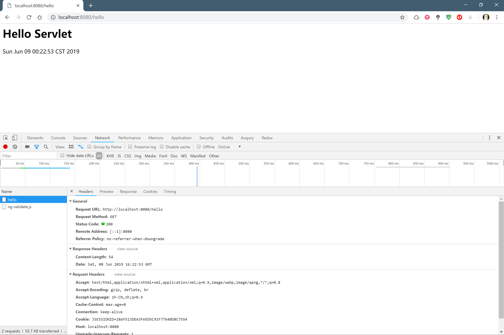

在浏览器中按F12打开开发者工具,点击network然后刷新页面,就可以看该网页的请求Header和响应Header.

我们就可以通过Servlet来访问请求头中的所有信息,比如url,比如cookie,比如session

我们加一行代码

```java
response.getWriter().println("<h1>Hello Servlet</h1>");
response.getWriter().println(request.getRequestURL()+"<br/>");
response.getWriter().println(new Date());
```

使用request.getRequestURL()方法来获取刚才在请求头中看到的Request URL然后打印到网页上看看~

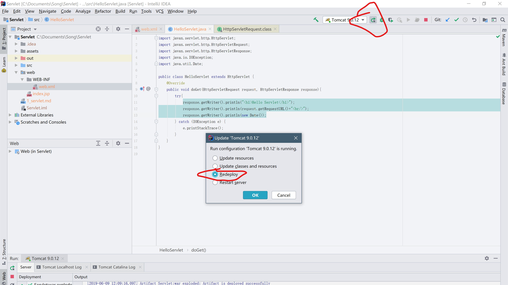

点击该按钮,然后刷新网页看看~

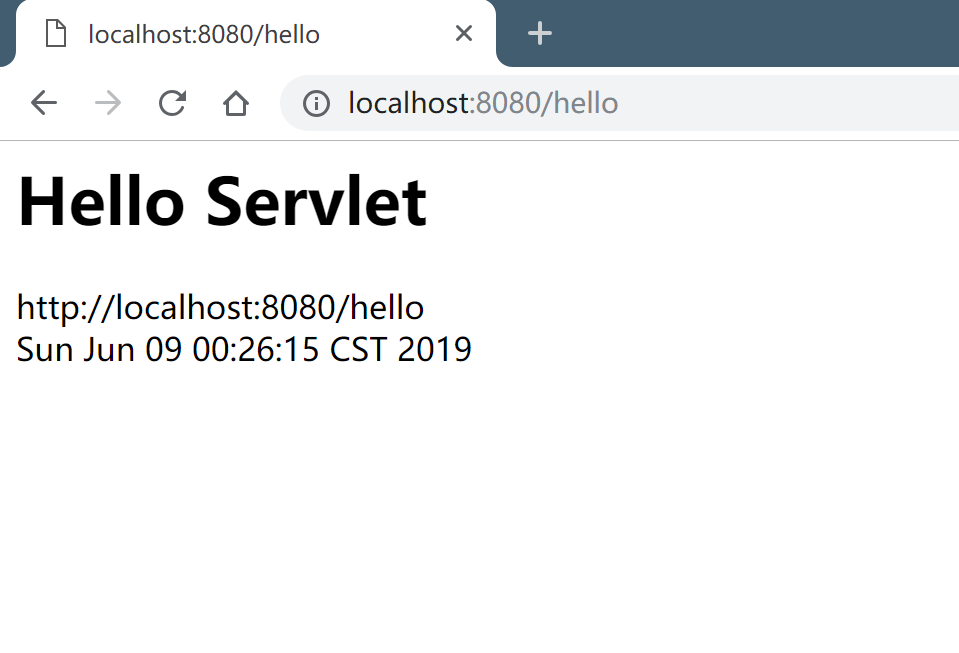

可以看到我们把请求头中的URL打印到页面上了...

这就是doGet第一个参数Request的作用,还有一个是response,相应的就是响应咯...

我们可以设置响应头,我们再添加一行代码~

```java
response.setHeader("TODAY","HELLO WORLD");
```

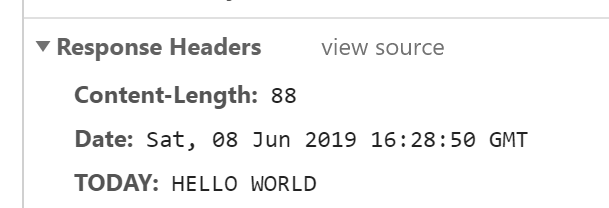

可以看到在前端的响应头有了我们设置的内容...

先写这么多吧...总结下该程序的运行流程~我记得JSP课里面讲过...不过应该已经忘了吧~

浏览器向服务器请求时，服务器不会直接执行我们的类，而是到web.xml里寻找路径名

1. 浏览器输入访问路径后，携带了请求行，头，体
2. Tomcat将请求头包装成一个java对象,该对象的类型为Request.
3. 根据访问路径找到已注册的servlet名称,比如我们在web.xml中的servlet-name为HelloServlet 
4. 根据映射找到对应的servlet名 
5. 根据根据servlet名找到我们全限定类名，既我们自己写的类
6. 如果是第一次访问的话,就将我们编写的Servlet编译成class文件,然后初始化,否则就直接运行我们编写的方法
7. 我们将想要返回的信息写入response
8. Tomcat把该response解析成http协议的响应头,然后将该response返回给浏览器

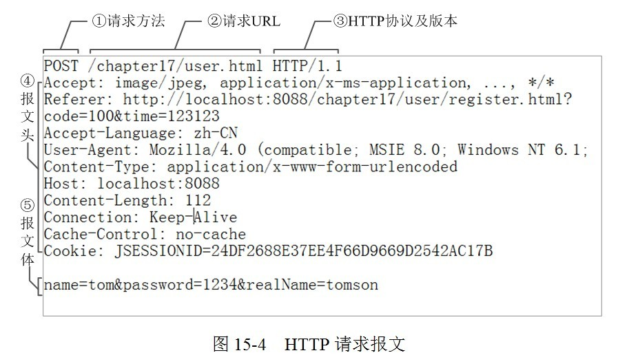

这是我从网上找的,应该还是很清晰明了的...

request对象就是把该内容包装成一个java类方便我们访问...类似的就是响应报文...

这些其实在计算机网络中有所涉及的...算是计算机基础吧~

如果想要知道我们编写的应用程序的原理,不能不对计算机基础进行学习的...不过我相信你应该看到不懂的会自己查的吧...我就简单把我认为很重要的基础部分以自己的理解写出来...可能不会完全正确...嗯~ o(*￣▽￣*)o

就写这些好了~明天再继续增加~先把servlet的内容写完.
