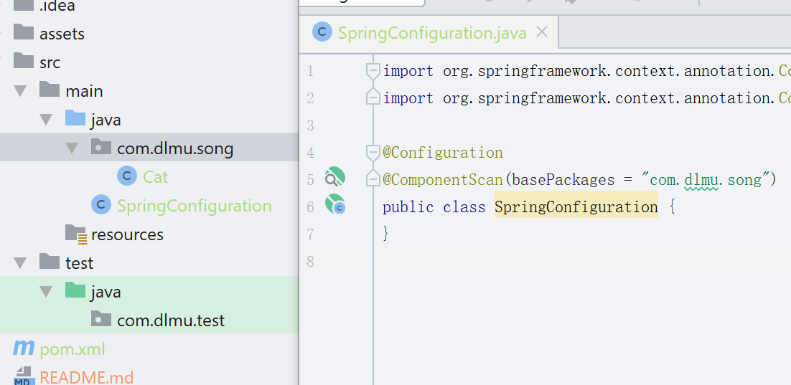

Spring还是很简单的...我之前的顺序错了,看过一遍Spring的书籍后发现还是从最基础讲的话后面的才能看懂233333而不能从最简单的开始...所以还是从最基础的Spring开始吧!

我也不知道你以后测试会用什么,是java还是js还是c,我先从java开始写吧,如果你要会java的测试,下面的这部分算是基础部分吧...不过你直接从单元测试开始看也没什么问题...毕竟测试是很简单的如果你不想知道原理的话...

## Spring介绍

Spring最重要的核心是提供了IoC容器的框架,IoC是什么呢?

Inverse of control,控制反转

学过C#还是知道的吧,创建一个对象的方式是用new关键字,

比如:

```java
public class Cat{
    public String name;
    public int age;
}
```

要创建一个猫的对象,就需要Cat cat = new Cat();

而通过Spring提供给我们的控制反转呢?

我们可以声明Cat为一个Component,即为一个组件,告诉Spring帮我们创建Cat并管理Cat,

就像这样子:

```java
@Component
public class Cat{}
```

那现在怎么创建一个对象呢?

只需要

```java
@Autowired
Cat cat;
```

然后就可以直接使用这个cat对象了.

这样来看,Spring就是帮我们创建一个实例,并且管理它的生命周期的一个框架.

Spring的目的就是简化开发,是为了让java写程序变得更简单而不是更难...之前是我自己太蠢了,没有理解到就瞎讲了233333

然后随着发展,Spring的业务面越来越广,又接着提供了诸如Spring AOP,Spring Security,Spring Data,Spring Web等等.然而他们的共同点就是都使用的IoC容器对对象进行创建和管理.

所有被Spring这样子管理的Java类就叫做Bean.

现在可以理解Spring了吧???没那么难的~

然后最基础的就是装配Bean了,就是告诉Spring容器哪些类是需要由它管理,怎么管理...

## 装配Bean

### 创建spring环境添加依赖

首先使用IDEA创建一个maven项目,不要选archetype,next后填好groupid和artifactid,然后选择文件夹,最后点finish就完成一个maven项目了.


然后是项目的基础样子,如图所示.


1. main>java>是用来放写的应用程序的,我又在下面创建了三个文件夹,分别是com,dlmu,song,显示为com.dlmu.song
2. main>test>是用来放单元测试的类的,同样的我创建了一个名字为com.dlmu.test的包,由于跟上面的名字有所重复,点Projects的下箭头切换到Packages可以看到是这样的


package就是java用来整理各个class的目录而已,比如说你在com>dlmu>song下创建了一个Cat.java,那么Cat的package就是com.dlmu.song,如果你要在别的地方引用Cat.java,就需要用import导入,导入的方法就是import com.dlmu.song.Cat;

3. 切换回pom.xml,该文件告诉maven这个项目都依赖哪些第三方的包(这里的包就是指别人写好的***.java,然后可以把多个.java打包成.jar格式的文件),现在要学的是Spring,所以我们就需要在pom.xml里添加Spring的包,从百度上搜maven repository,在里面找spring context.


搜到的是这样的东西,maven下对应的拷贝到pom.xml的dependencies标签下就可以了,dependencies需要你自己敲一下,然后这个页面往下翻,说一下为什么要添加这个.


可以看到这个包总共有四个是在里面包含的依赖,分别是aop,beans,core,expression.

看名字就很容易直到它们的都是干嘛用的了,core是核心,就是说它提供给我们IoC依赖注入的方法.

然后beans很容易得知它是帮我们管理java对象的.

aop是面向切面编程,之前我说过来着不过我估计你忘了...这个会放在单元测试后面说...

expression是spring的一些特殊的表达式,提供了很多语法糖一样的东西...

然后我们也想在编写的同时进行一些单元测试对吧?所以我们继续在maven repository这个网页里搜spring test和junit


其中spring test提供给我们一个更方便进行单元测试的平台,而junit里包含了我们要用来单元测试的方法.

最终添加完这三个依赖后的pom.xml是这样子的


### 首先介绍自动装配

1. 首先在com.dlmu.song目录下创建一个类,类名无所谓,我为了好理解起的名字是SpringConfiguration,意思就是这是一个Spring的配置类,只需要在该类上用@Configuration注解就成功声明了这是一个配置类.下面的注解@ComponentScan表示我们要将哪个目录下的类让Spring帮我们管理,可以看到我现在配置的目录是com.dlmu.song,Spring会自动管理该目录下我们声明为Component类的对象.



2. 然后在com.dlmu.song目录底下创建一个Cat类,内容如下


内容很简单,特点就是在类名上我们使用了@Component注解来声明这是一个组件类,利用@Component注解来让之前写的配置类知道这个类需要被Spring管理.

#### 单元测试

3. 接下来就是写测试类了,看看Java是怎么进行单元测试的.在com.dlmu.test下创建CatTest类,内容如下


首先解释类上面的两个注解,首先你可以观察到@ContextConfiguration注解来自springframework的test,就是之前导入的spring test包,然后@ExtendWith注解来自junit,刚才导入的junit包.

第一个注解告诉spring的测试包,我们装配bean的配置在哪里,第二个注解告诉junit,通过springframe的test扩展junit的功能.

然后就是单元测试了,首先是@Autowired注解,该注解用在属性声明上,告诉spring容器在我们需要哪个类的时候就创建这个类的实例给我们.

@Test注解声明该方法是一个单元测试方法,其中Assertions.assertNotNull判断一个对象是不是为空,我们不是没用new创建Cat对象嘛?所以想看看spring容器是不是真的给我们实例化成功了,所以用该断言语句判断一下.

然后再用assertEquals判断两个参数的值是否相等.

这样就是一个完整的Spring应用和junit单元测试应用.

点击类名左边哪个绿色圆圈的箭头运行,看看结果吧~


我为了对比明显又写了一个测试失败的类,可以从下方的运行结果中看到catTest测试通过了,而failTest测试失败了.

这是为什么呢?我们明明没有在这个方法里使用setName设置cat的名字,为什么Actual的值还是miaomiao?

原因就是Spring容器创建Bean实例时使用的是单例设计模式,单例设计模式算是最好记的一个设计模式了...就是说所有的调用只返回一个实例,不管在哪里调用,使用的都是同一个Bean,可以理解吧?所以即使第一个测试跟第二个测试毫无关联,它们调用的cat也是同一个cat.

那怎么修改为每次调用cat的时候返回新的实例呢?只需要在Cat类声明它的@Scope为prototype就可以了.

就像这样

```
@Component
@Scope("prototype")
public class Cat {
    private String name;
    private int age;
}
```

这样就可以了,我们再测试一下吧~


这时候发现单元测试通过了,第二次调用的时候由于没有setName所以name的值为null~

当然scope还有别的属性,也还有其他注解,这篇文档就先不讲了吧~

目前就是最基础的部分了.

## result

这就是最基本的java的Spring和Junit单元测试的用法和原理了...

应该都能看懂吧?感觉我每行代码都基本解释了23333

如果你想知道为什么这样就可以成功测试,就看看其他部分的文档吧...我会写的很详细每行都解释的~

下一篇点[这里](./2_bean.md)~