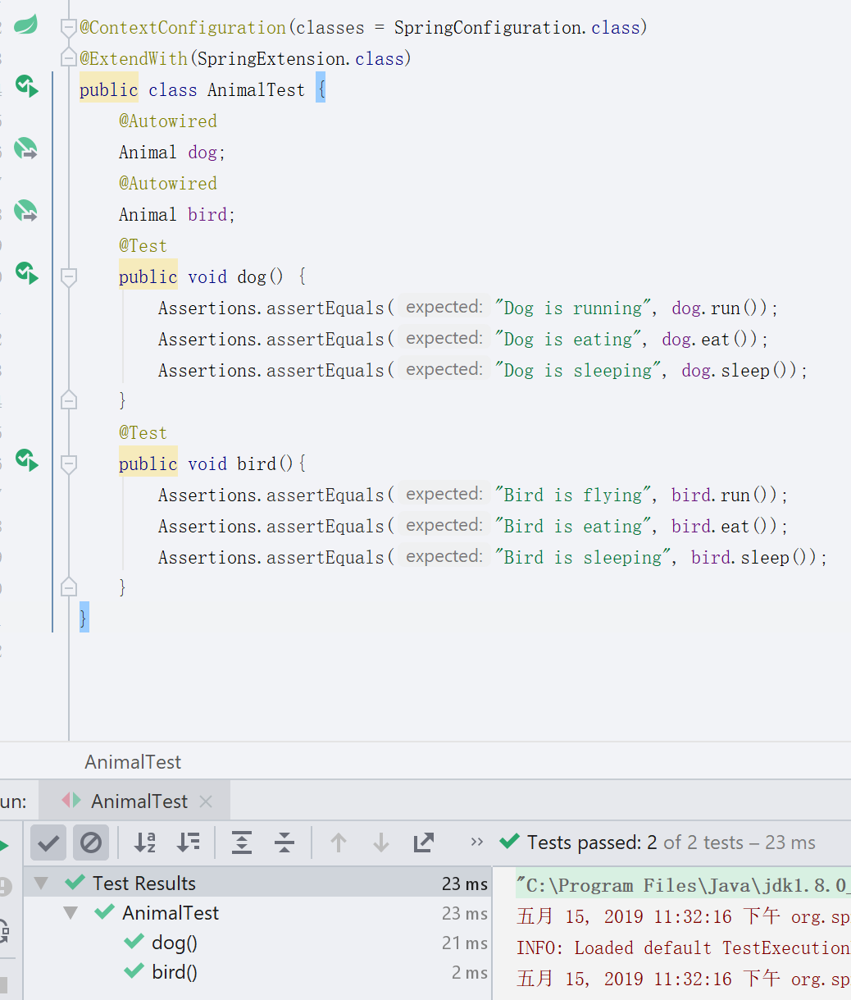
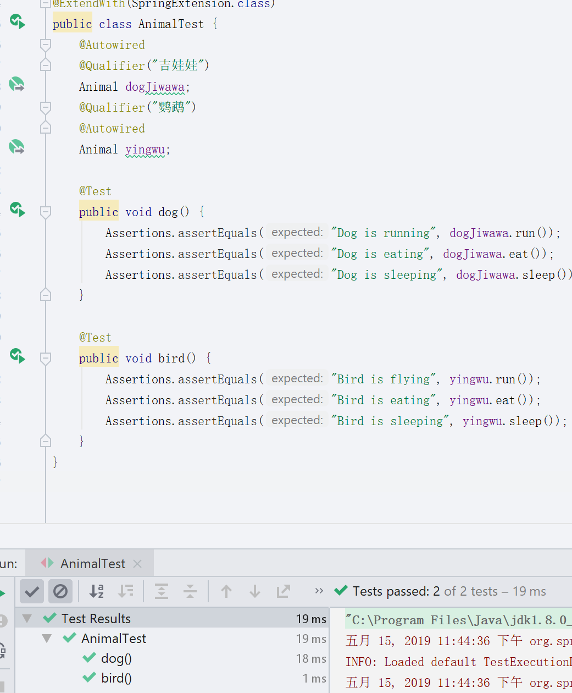
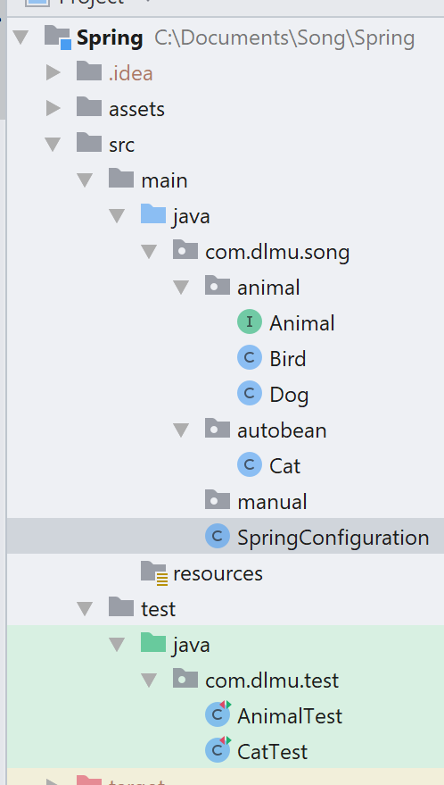
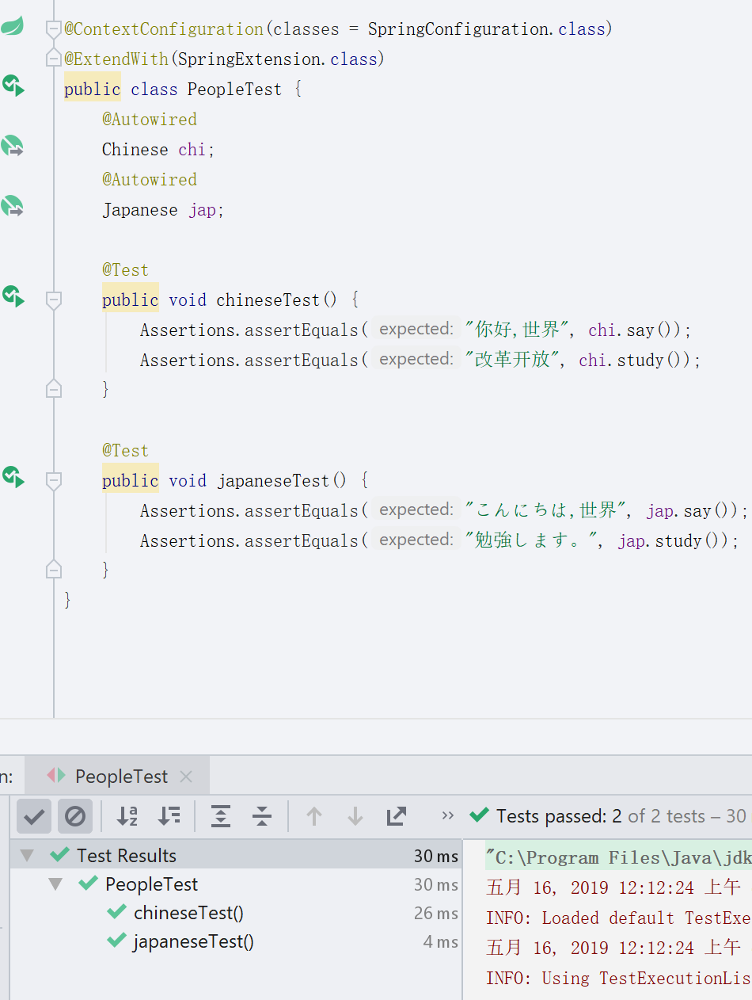
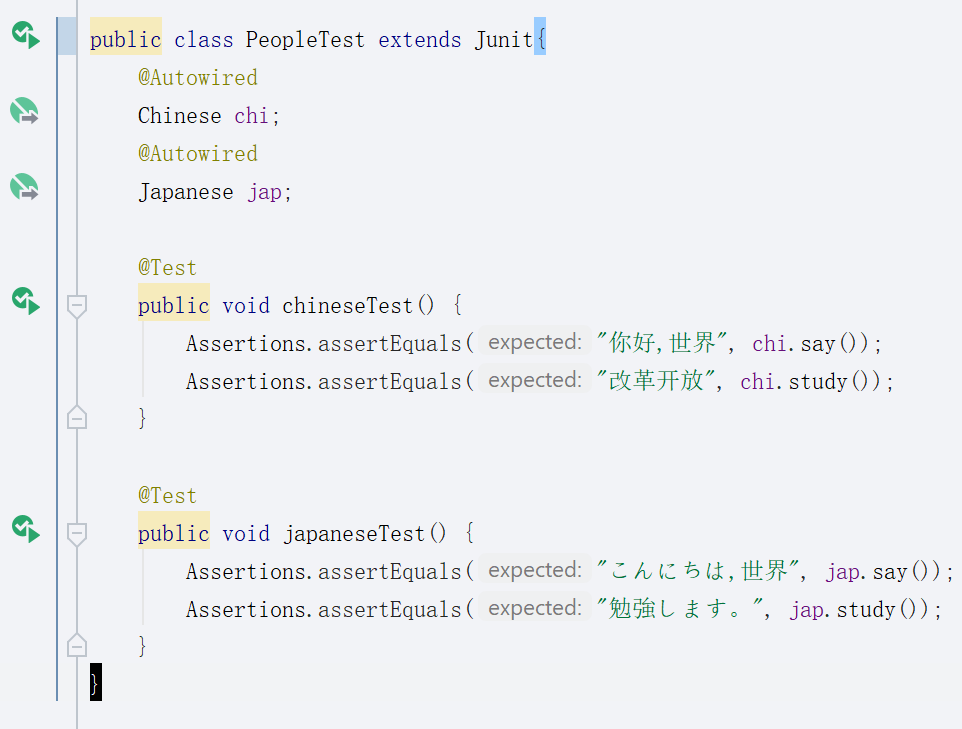

# 第二部分~

*接下来叙述如何装配同一个类型的多个bean,然后如何手动装配bean吧!~*

*然后就是...截图太占空间了==所以就代码部分先用文字描述吧,最后在总结中放图片展示一下结果吧~*

## 装配多个bean

首先整理一下目录,再com.dlmu.song目录下再创建一个文件夹(package),我命名为animal

在里面创建一个Animal接口,内容如下

```java
public interface Animal{
    String run();
    String eat();
    String sleep();
}
```

规定了implement该接口的类都必须实现吃喝睡这三个方法,然后创建一个Dog类实现这三个方法.

```java
@Component
public class Dog implements Animal{
    @Override
    public String run() {
        return new String("Dog is running");
    }
    @Override
    public String eat() {
        return new String("Dog is eating");
    }
    @Override
    public String sleep() {
        return new String("Dog is sleeping");
    }
}
```

类似这样子,@Override表示该方法是重写了已有的方法,然后我们创建一个Test测试一下Animal类吧.

```java
@ContextConfiguration(classes = SpringConfiguration.class)
@ExtendWith(SpringExtension.class)
public class AnimalTest {
    @Autowired
    Animal dog;

    @Test
    public void animal() {
        Assertions.assertEquals("Dog is running", dog.run());
        Assertions.assertEquals("Dog is eating", dog.eat());
        Assertions.assertEquals("Dog is sleeping", dog.sleep());
    }
}
```

运行测试成功了,可以观察到我们声明的dog实际上不是Dog,而是一个Animal,在使用的时候也只能使用Animal里提供的方法,

那么如果我们在创建一个动物类继承Animal接口,那它怎么知道到底运行哪个具体的实现类呢?

现在再创建一个Bird继承Animal接口试试,

```java
@Component
public class Bird implements Animal{
    @Override
    public String run() {
        return new String("Bird is flying");
    }
    @Override
    public String eat() {
        return new String("Bird is eating");
    }
    @Override
    public String sleep() {
        return new String("Bird is sleeping");
    }
}
```

给测试类增加新的代码,运行下看看结果.



@Autowired自动帮我们根据属性名字来确定到底实例化哪个具体的实体类给我们用,是不是很方便呢?

要想让spring自动帮我们这样子装配,属性名字是要装配的bean name,默认是要装配类的小驼峰名称,比如说类名是ChinaPeople,那么它的bean name就是chinaPeople,所以要让spring自动实例化的话就需要声明为:

```java
@Autowired
ChinaPeople chinaPeople
```

这样子,很容易理解吧?

那如果我们想要自定义名称呢?

自定义名称使用的注解是@Qualifier,可以同时在@Component注解上和@Autowired上使用,也可以单独再@Autowired上使用,如果你不想让ChinaPeople的属性名称非要是chinaPeople,那就可以单独在@Autowired上使用,就像这样:

```java
@Autowired
@Qualifier("chinaPeople")
ChinaPeople people
```

@Qualifier中的值即为bean name,可以理解吧?

那么如果同时在@Component上和@Autowired上使用呢?只需要两个@Qualifier中的值一一对应就可以了.

比如这样:

```java
@Component
@Qualifier("吉娃娃")
public class Dog implements Animal
```

那么我们在单元测试的类自动装配的时候就需要改为这样:

```java
@Autowired
@Qualifier("吉娃娃")
Animal dogJiwawa;
```

这样属性名就随便自己定义了,这里我改成了dogJiwawa,由于有了@Qualifier帮我们分辨具体装配哪个类了,所以属性名就可以自己随便写了~现在运行单元测试看看结果吧~



可以看到测试通过了...到这里自动装配bean的基础差不多就这样子了~剩下的你如果觉得好玩的话可以自己找书看看,或者找找教程什么的...

现在的目录是这样子的:



接下来是手动装配bean的方法,手动装配的话我就只写一丢丢吧,毕竟一般用自动装配的时候比较多,手动的话需要用的时候再去查查了解也还是可以的...

要记住,spring是为了方便java开发的,而不是增加java开发的难度,所以这些东西都没什么难度的,都是很简单很简单只要知道就会用的东西,剩下的就是多用多熟练的问题了...同等水平下后端工资真的要比前端高的...所以我还是觉得...学后端比较好吧,同等层次的后端比前端不会难只会更简单的,然而工资还是后端占优势的...

## 手动装配bean

在com.dlmu.song目录下创建manual文件夹(package/包),增加一个Japanese类.

```java
public class Japanese{
    public String say() {
        return new String("こんにちは,世界");
    }
    public String study() {
        return new String("勉強します。");
    }
}
```

再增加一个Chinese类.

```java
public class Chinese {
    public String say() {
        return new String("你好,世界");
    }
    public String study() {
        return new String("改革开放");
    }
}
```

可以看到什么注解都没有,然后我们打开之前创建的SpringConfiguration类,之前在里面什么都没有对吧?现在我们增加如下内容

```java
@Configuration
@ComponentScan(basePackages = "com.dlmu.song")
public class SpringConfiguration {
    @Bean
    public Chinese getChinese(){
        return new Chinese();
    }
    @Bean
    public Japanese getJapanese(){
        return new Japanese();
    }
}
```

如果只是测试这两个人的话可以把上面的ComponentScan注解去掉,因为我们刚才编写的这两个类并没有用到Component注解,所以是扫描不到的,

我们需要在里面添加两个方法,返回值类型是要实例化的类的类型,然后打上@Bean的注解,声明这个是一个bean.

只要最终你return了一个新对象就可以了,不管你在这中间都发生了什么...比如你可以让它随机new一个对象,只要对象跟返回类型相同就可以了,比如之前的Animal,你可以让它随机new一个Dog或者Bird,就像这样.

```java
@Bean
public Animal getAnimal(){
    int number = (int)Math.floor(Math.random()) + 1;
    if(number == 1){
        return new Dog();
    }
    else if(number == 2){
        return new Bird();
    }
}
```

这就是手动装配bean,很简单吧?

现在让我们编写测试类,看看最终结果.



嗯就像这样子,测试通过了~


最后是一个小贴士~

我们每个单元测试类上面是不是都打了相同的标签?这样重复写@ContextConguration和@ExtendWith很烦吧...

让我们在com.spring.test包下创建一个Junit类,内容如下

```java
@ContextConfiguration(classes = SpringConfiguration.class)
@ExtendWith(SpringExtension.class)
public class Junit {
}
```

然后再将测试类中的注解删掉,让它们都继承这个Junit,比如这样



是不是干净了很多呢?

将其他单元测试类都改成这样子吧~

就这些内容吧...接下来是AOP的内容,稍微拓展一点~