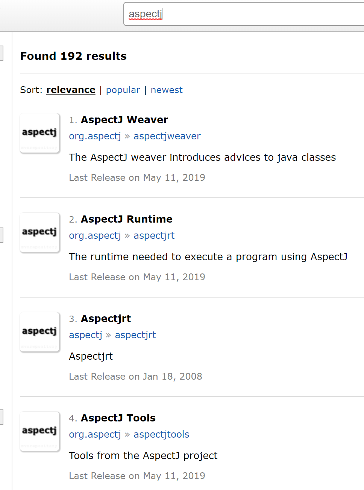
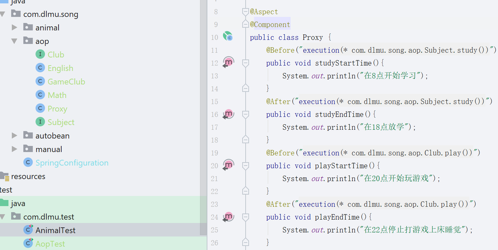
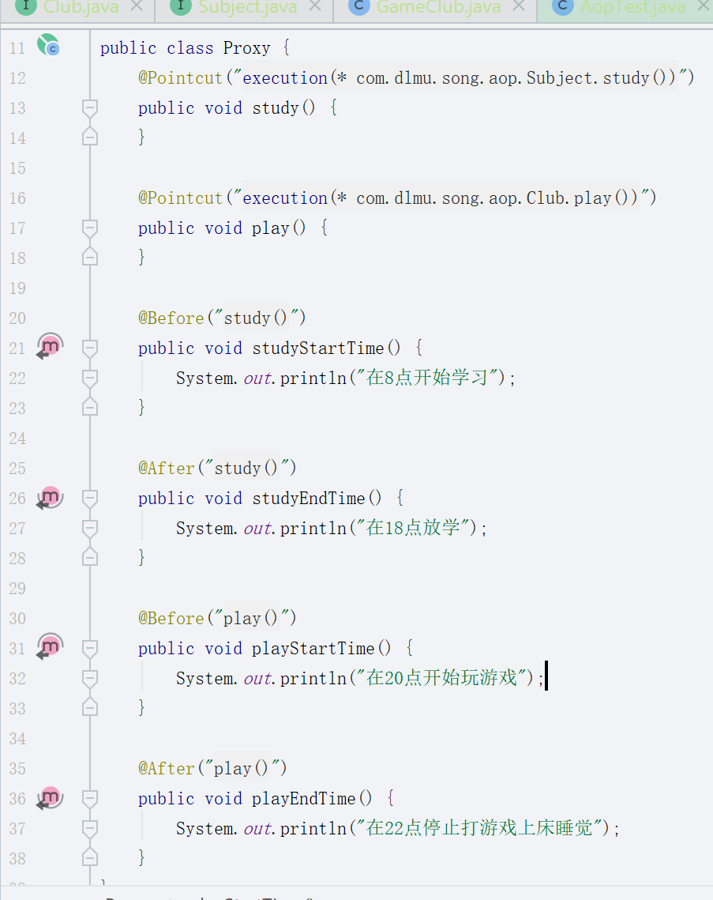
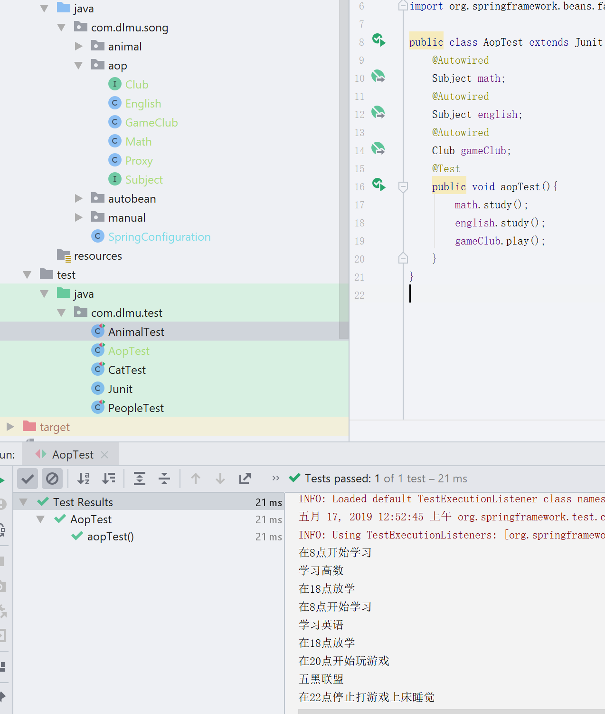

*AOP原理是动态代理,我简单写一点代理设计模式的内容吧~*

设计模式是一种思想,简单说就是一种套路,之前的大佬们总结的如何编写优美可维护代码的一个套路,所以基本上只要知道了就可以理解原理,然后就是在平时自己写代码的时候用一用就是了,熟能生巧嘛...

# AOP

## 代理设计模式

代理,字面意思上就是把事情托付给别人去帮自己完成...

比如买车票的时候,现在一般都会在网上让第三方平台帮自己购买,比如去哪儿,或者携程,这些平台就算是自己的一个代理了,可以理解为中介.

比如说我们写一个接口

```java
public interface Subject{
	void study();
}
```

然后写一个实现类

```java
public class Math implement Subject {
    void study(){System.out.println("study math")}
}
```

然后是一个代理类

```java
public class ProxySubject implement Subject {
    private Subject subject;
    public ProxySubject(Subject subject){
        this.subject = subject;
    }
    public void study(){
        System.out.println("8点上课");
        subject.study();
        System.out.println("18点下课");
    }
}
```

如何使用呢?

```java
public class Study{
    public static void main(String arg[]){
        ProxySubject proxy = new ProxySubject(new Math());
        proxy.study();
    }
}
```


这样就算是完成了一个基本的代理设计模式,很简单对吧?

但是用处很多,比如说这个代理类可以在实际调用之前增加一些功能,比如说给study前设置一个开始时间,在study后写一个结束时间.可能会有疑问,为什么不直接在Math里写呢?

因为不止有一个科目呀,可能会有多个科目,你可以看到在Proxy中我们声明的变量类型是Subject,也就是说只要implement Subject的所有类都可以使用这个代理类,这样就减少了很多重复的代码...最常用的功能就是打印log了,在上班中看他们的C语言代码是不是写了很多LOG这种东西?要是有了代理的话就可以减少很多这样的重复代码了.

那么什么是动态代理呢?

在普通的代理中,要为每一种类型的类编写一个代理类,当类很多很多的时候可能我们也要编写很多类型的代理类,能不能不编写代理类,直接得到需要代理的对象,然后根据这个对象的信息来增加一些诸如打印log的功能?

这种不编写代理类却能完成代理功能的思想就是动态代理.原理是java中的反射...

大致就是,在目标对象(需要代理的类)和代理对象中间多了一个中间件,这个中间件就是用动态代理实现的一个对象,我们只需要把我们的目标对象和需要添加的功能告诉它,在运行目标对象的时候动态代理会自动把功能添加上去...

写这么多乱七八糟的,不如show me the code~

```java
public class ProxyHandler implements InvocationHandler
{
    private Object tar;
    //绑定委托对象，并返回代理类
    public Object bind(Object tar)
    {
        this.tar = tar;
        //绑定该类实现的所有接口，取得代理类 
        return Proxy.newProxyInstance(tar.getClass().getClassLoader(),
                                      tar.getClass().getInterfaces(),
                                      this);
    }
    public Object invoke(Object proxy , Method method , Object[] args)
    {
        Object result = null;
        //这里就可以进行所谓的AOP编程了
        //在调用具体函数方法前，执行功能处理
        result = method.invoke(tar,args);
        //在调用具体函数方法后，执行功能处理
        return result;
    }
}
```

这个大致就是动态代理的一个中间件,这个是AOP框架帮我们写好的,所以实际上我们是不用写这个玩意的,你看不懂也没关系,大致知道有什么用就可以了...

现在我们所需要的全部代码是什么呢?

```java
public interface Subject{
    void study();
}
public class Math implement Subject{
    public void study(){
        //sout是System.out.println的缩写,在idea里也可以直接输入sout,它会自动帮你补全成完成的...
        sout("学习数学");
    }
}
public interface Club{
    void play();
}
public class GameClub implement Club{
    public void play(){
        sout("五黑");
    }
}
public class Test{
    public static void main(String args[]){
        ProxyHandler proxy = new ProxyHandler();
        Subject math = (Subject) proxy.bind(new Math());
        Club game = (Club) proxy.bind(new GameClub());
        math.study();
        game.play();
    }
}
```

这样是不是很明显能看出区别?

也就是说不需要你手动去写代理类,只需要把要代理的对象告诉中间件就可以像之前的普通代理一样增加自己需要的功能了~

## AOP设计模式

现在想想AOP的是什么东西?

面向切面编程Aspect Oriented Programming

我们把需要被代理对象中的那些方法称为切入点,我们想增加的东西称为通知,通知和切入点共同组成的部分就是切面,还是很好理解的吧?即使你现在不理解,那就看看下面的使用方法吧~看完使用方法再结合术语看能更好理解...

在我们的程序中不会只有一个类需要log吧?有很多很多都需要打印出它们的日志,难道我们要在每个实现里面都编写吗?就像你在测试C语言的时候他们编写的代码那样吗?很多Log是不是都大同小异?编写那些重复代码又麻烦又不优雅~

AOP设计模式就是为了解决这类问题而想出来的一个套路,是不是觉得跟代理很契合呢?

在我不知道AOP的原理的时候学了代理,直觉上感觉这两者很契合,应该是配对使用的没错了~然后就在上班的时候摸鱼查了查了解了下...

那么现在开始正式使用Spring提供给我们的AOP框架吧~

首先是添加AOP的依赖,我们依旧在maven仓库里搜aspectj,可以看到有几个长得比较像



我们需要用到的是第一个,添加该依赖到pom.xml中...

然后在com.dlmu.song下创建aop包(package/等同于文件夹),将之前写的那些Subject,Club类似的添加进去...

完整代码实例:

Club接口和Subject接口我就不写了,跟上面的相同分别只有一个play()方法和study()方法.

```java
//这个是GameClub.java中的内容
@Component
public class GameClub implements Club{
    @Override
    public void play() {
        System.out.println("五黑联盟");
    }
}
//这个是Math.java中的内容
@Component
public class Math implements Subject{
    @Override
    public void study() {
        System.out.println("学习高数");
    }
}
//这个是English.java中的内容
@Component
public class English implements Subject{
    @Override
    public void study() {
        System.out.println("学习英语");
    }
}
```

我截个图吧~



可以参考我文件创建的地方...

右边是具体的代理方法,首先你可以看到在类上面多了个注解@Aspect,这个注解就是告诉Spring,这个是一个切面,要把这个切面切到我们需要增加功能的那些类里...

然后是各个方法上面的注解,@Before和@After,意思就是需要代理的方法运行结束前或者运行结束后切入,不过我们是不是又有重复代码了?就execution(*)那部分的东西是可以单独提出来的,再整理整理...



利用@PointCut注解,我们可以把那一长串重复的的东西提取出来,这个东西名称是AspectJ表达式,是AOP框架AspectJ为了方便AOP编程而提供的一系列语法糖,具体如果你有兴趣的话可以搜一搜,不过即使不知道它的具体语法,但还是能明白它的意思吧?

我简单说明一下吧

```java
execution(* com.dlmu.song.aop.Club.play())
```

首先execution是固定格式,第一个*所在的位置是该方法的返回值类型,星号是一个通配符,表示所有类型,在这里你也可以改成void,因为我们的play()方法返回值为void.

后面的就是具体的方法了,前面的com.dlmu.song.aop是包名,Club是类名,play()是方法...

还有更多的选择切面的方法,就不详细说了~害怕嫌烦23333

哦对,忘了开启AOP代理了,让我们找到SpringConfiguration,再在类上面添加一个注解

@EnableAspectJAutoProxy,嘛从名字就能知道是干嘛用的吧~

然后写个测试类测试下试试~



是不是很简单呢?

这就是具体的面向切面编程,大概就是这么写的,可能还有更多更多的部分,这里就不细说了,可能会在随后的项目中展开,那时我就不会这么详细的写文档了,我会通过代码中的注释来解释它们的用法~

接下来我会写一些反射和注解的内容,反射是什么呢?注解为什么可以实现那么多配置功能呢?

接下来会写注解的原理,如果你有兴趣的话...可以继续往下看...没兴趣的话.我觉得你应该是看不到这里的吧~

