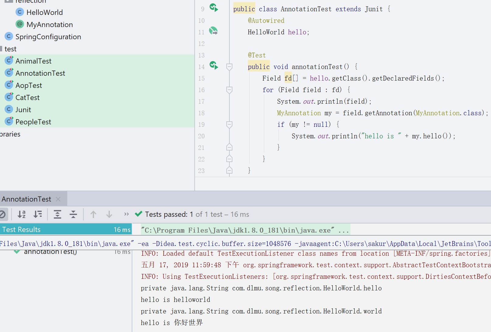

*写一个很简单的利用反射获取注解上信息的例子吧*

## 注解以及反射

Java中的注解是在interface前面多加一个@来声明的,先自定义一个自己的注解试试看

```java
@Target(ElementType.FIELD)
@Retention(RetentionPolicy.RUNTIME)
public @interface MyAnnotation{
    String hello();
}
```

Target和Retention是两个元注解.什么是元注解?

就是标识注解的注解,这两个是自定义注解的关键吧,首先是Target,决定了这个自定义的注解是放在class上,还是放在变量上,还是放在方法上,ElementType.FIELD是变量上,同理还有ElementType.Method.

然后是Retention注解,这个是决定了注解上的内容能保留到什么时候,RUNTIME就是保留到程序运行期间都存在,如果是还有两个值,一个是SOURCE和CLASS,其中SOURCE只会留在源文件里,java不是会先把.java编译成.class的字节码文件嘛,如果是SOURCE的话,在class的字节码文件里就不会有标识为SOURCE注解的信息,这样在运行程序的时候就没法获取到注解里的值了,同样的,CLASS是只保留到字节码文件里.

而反射实际上就是在程序运行期间获取一个类的实例还有这个类的所有构造,包括私有变量,私有方法,静态变量静态方法等,只要在类里面写的内容都可以通过反射来获得...

下面让我们编写一个例子看看吧~

刚才编写了一个自定义的注解,现在我们使用这个注解看看

```java
@Component
public class HelloWorld{
    @MyAnnotation(hello="helloworld")
    private String hello;
    @MyAnnotation(hello = "你好世界")
    private String world;
}
```

这个是非常简单了吧?只有一个变量

现在来编写个测试类看看.

```java
public class AnnotationTest extends Junit{
    @Autowired
    private HelloWorld hello;
    @Test
    public void annotationTest(){
        Field fd[] = hello.getClass().getDeclaredFields();
        for(Field field : fd){
            sout(field);
            MyAnnotation my = field.getAnnotation(MyAnnotation.class);
            if(my!=null){
                Sout("hello is "+my.hello());
            }
        }
    }
}
```

这样测试类就编写好了,哪里是反射的语法呢?

Field fd[] = hello.getClass().getDeclaredFields();

getClass()可以获得这个类的所有类型信息,获得到这个类的所有结构后通过调用getDeclaredFields()来获得它的所有变量的信息,获得变量信息后,再通过getAnnotation来获得指定类型的注解,其中的参数就是你想获得到注解的类型,如果不为空,就把注解的信息打印出来...

其中getClass(),getDeclaredFields(),getAnnotation()这三个方法就是的内容反射,可以看到语法还是很简单的,但是功能很强大的~具体强大在什么地方,在我们的使用过程中用了那么多注解来简化配置就能看出来了嘛~

现在运行下测试类看看结果...



可以看到,在打印的field内容包含了它的作用域(private),还有它的类型(java.lang.String),还有所在的包(com.dlmu.song.reflection)所在的类(HelloWorld),还有它的名字(hello)

基本上应有尽有了,然后通过调用field的getAnnotation方法再将它注解中的内容打印出来.


现在可以想象到Spring大概是怎么通过注解来装配Bean的了吧?

它会根据递归扫描你在SpringConfiguration里想要扫描的包,然后判断Component注解是否能获取到,如果能获取到,就说明它需要帮我们管理这个类的生命周期,就把这个类装配成Bean.

当然Spring肯定还做了很多优化,也不会像我写的这么简单,但大概的原理就是这样子,还是很简单的~

这样子注解和反射的内容就写完了...明天的话.Spring的基础部分差不多就这些了...别的的话,明天再看吧~

估计会写写Web应用开发的部分,从最原始的Servlet开始吧~然后再写写对Servlet进行了封装的SpringMvc,然后就是最简单的SpringBoot了...

其中会穿插一些别的内容,比如更简便的操作数据库的方式,从最原始的方法到目前流行的方法...

写完这些就开始应用到自己编写的项目里吧...