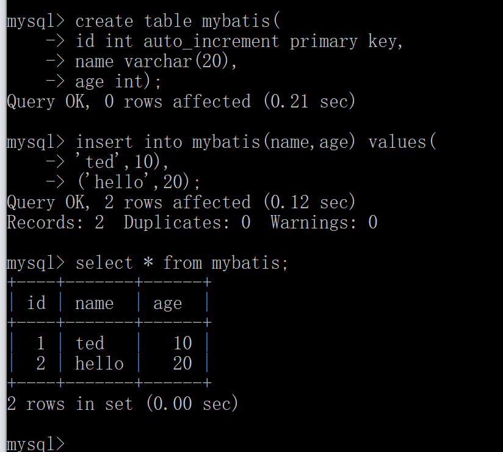
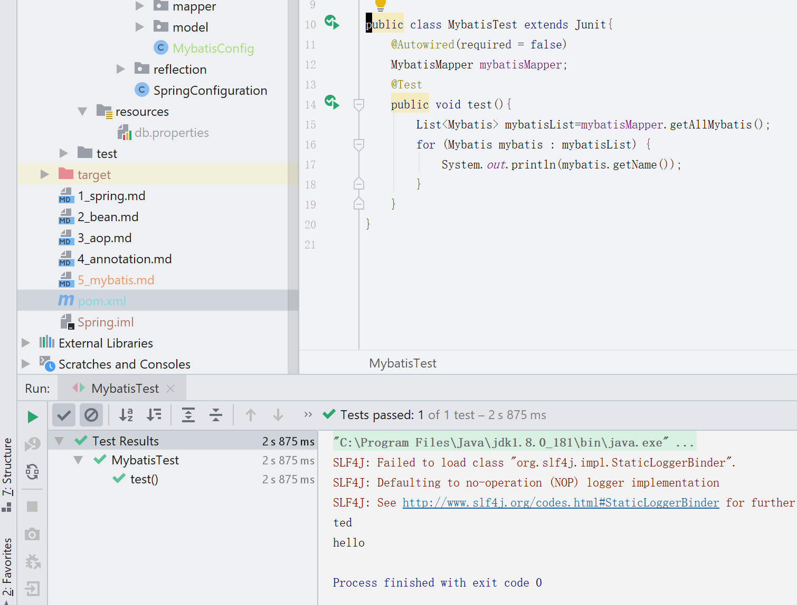

*想了想,写web服务应用的话少不了数据库操作,所以还是先介绍下mybatis吧,是一个不完整的ORM(Object Relational Mapping)框架,ORM就是能把关系数据库中的数据映射为Java对象*

# MyBatis介绍

比如说数据库有个user table

```mysql
create table mybatis(
id int auto_increment primary key,
name varchar(20),
age int
);
```

然后Java中一个对象

```java
public class Mybatis{
    private String name;
    private int age;
}
```

ORM框架会在获取到数据的同时,将获取到的数据库中的值根据默认或者自定义的方式来自动给这个java对象中的变量赋值,为什么说它不是一个完整的ORM框架?明天跟Hibernate对比下就知道为什么了~今天先简单使用一下Mybatis吧~

首先依旧是添加依赖,我们需要的依赖有

1. mybatis
2. spring-mybatis
3. mysql-connector-java
4. spring-jdbc
5. hikariCP

```xml
<!-- https://mvnrepository.com/artifact/org.mybatis/mybatis -->
<!-- 这个是mybatis的核心部分 -->
<dependency>
    <groupId>org.mybatis</groupId>
    <artifactId>mybatis</artifactId>
    <version>3.5.1</version>
</dependency>
```

```xml
<!-- https://mvnrepository.com/artifact/org.mybatis/mybatis-spring -->
<!-- 这个是连接spring和mybatis的部分 -->
<dependency>
    <groupId>org.mybatis</groupId>
    <artifactId>mybatis-spring</artifactId>
    <version>2.0.1</version>
</dependency>
```

```xml
<!-- https://mvnrepository.com/artifact/mysql/mysql-connector-java -->
<!-- 这个是用来让java可以连接mysql数据库的包 -->
<dependency>
    <groupId>mysql</groupId>
    <artifactId>mysql-connector-java</artifactId>
    <version>8.0.16</version>
</dependency>
```

```xml
<!-- https://mvnrepository.com/artifact/org.springframework/spring-jdbc -->
<!-- jdbc是java自带实现的一套操作数据库的包,而spring jdbc是连接spring和jdbc的包
 	jdbc就类似于之前学asp.net里的odbc或者sql那个,使用方法基本是一样的.
-->
<dependency>
    <groupId>org.springframework</groupId>
    <artifactId>spring-jdbc</artifactId>
    <version>5.1.7.RELEASE</version>
</dependency>
```

```xml
<!-- https://mvnrepository.com/artifact/com.zaxxer/HikariCP -->
<!-- 是一种数据库连接池,目前性能最好的一个 -->
<dependency>
    <groupId>com.zaxxer</groupId>
    <artifactId>HikariCP</artifactId>
    <version>3.3.1</version>
</dependency>
```

## 数据库连接池

可能你会不太理解数据库连接池吧?

以前用asp.net操作数据库还记得么?不记得就回忆下~

```c#
//首先创建连接
string dbconnection = "server=localhost;user id=root;password=wanxinyan;database=yimi; pooling=true;"
string _conn = WebConfigurationManager.ConnectionStrings["DBConnection"].ConnectionString;
MySqlConnection conn = new MySqlConnection(_conn);
//然后创建sql语句,并且使用命令来进行查询
string sqlQuery = "select * from user";
MySqlCommand comm = new MySqlCommand(sqlQuery,conn);
//最终读取数据
MySqlDataReader dr = comm.ExecuteReader();
if(dr.Read()){
    ......
}
//最后关闭连接
conn.Close();
```

这是一个标准的连接数据库的流程,同样的在java里也是类似这样的代码,是不是很麻烦?实际上连接数据库底层代码就是这些东西,每次使用查询都要创建一个数据库的连接请求才能进行查询,很浪费性能...

而数据库连接池就是,一个容器里放了很多个已经创建好的数据库连接,你要查询的时候直接就可以使用池子里的连接来进行查询就可以了,并且也支持一个连接进行多次查询,多个用户就可以利用池子中的多个连接进行查询了,而释放连接也不需要我们自己写conn.Close(),容器会帮我们进行管理.

也就是说有了数据库连接池,我们在查询数据库的时候就不需要每次都重复写Connection,然后再conn.Close(),而且因为减少了创建数据库连接,所以能很有效的提高性能.

而HikariCP(像光(日语)一样快233333)就是目前常用的一个数据库连接池的java实现包.

介绍完了所有的依赖包的作用,我们来开始连接数据库吧~

## 配置数据库连接

1. 在src.main下有一个resources包对吧?里面是用来放配置文件的,我们创建一个db.properties配置文件,配置文件后缀有两种,一种yaml,一种就是properties,常用的是properties.都很简单的,见过就会用233333都不需要学的...
2. 写其中的内容

```properties
jdbc.driver=com.mysql.cj.jdbc.Driver
jdbc.username=root
jdbc.password=ilikeshe2
jdbc.url=jdbc:mysql://localhost:3306/mybatis?useUnicode=true&characterEncoding=UTF-8&serverTimezone=UTC
```

这个是我自己的配置,java在连接mysql8.0版本的时候需要手动在url里添加时区的配置,即serverTimezone=UTC这句话,别的地方应该都很容易理解了...

3. 在com.dlmu.song下创建一个mybatis包,再创建一个MyBatisConfig类,用来配置Mybatis.内容如下

```java
@Configuration
//PropertySource这个注解默认会从resources包下进行配置查找
@PropertySource(value = "classpath:db.properties")
//扫描mapper包下的映射类,自动装配
@MapperScan("com.dlmu.song.mybatis.mapper")
public class MybatisConfig {
    //通过构造方法在实例配置类的时候就注入一个Environment类常量,用来获取db.properties的配置
    private final Environment env;
    public MybatisConfig(Environment env) {
        this.env = env;
    }
	//手动装配bean,这个是使用hikari数据库连接池来连接mysql数据源
    @Bean
    public HikariDataSource dataSource() {
        HikariDataSource dataSource = new HikariDataSource();
        //通过environment来获取之前写好的配置并赋值给数据源
        dataSource.setDriverClassName(env.getProperty("jdbc.driver"));
        dataSource.setJdbcUrl(env.getProperty("jdbc.url"));
        dataSource.setUsername(env.getProperty("jdbc.username"));
        dataSource.setPassword(env.getProperty("jdbc.password"));
        //多写写就知道该怎么手动装配bean了,这些英文单词还是很好理解的~
        return dataSource;
    }
	//数据库会话工厂,sqlSessionFactory可以创建SqlSession的实例,而SqlSession类似于Asp.net中的SqlCommand,用来查询数据库的
    @Bean
    public SqlSessionFactory sqlSessionFactory() throws Exception {
        SqlSessionFactoryBean factoryBean = new SqlSessionFactoryBean();
        factoryBean.setDataSource(dataSource());
        return factoryBean.getObject();
}
```

4. 之前在数据库创建了一个mybatis表对吧?本文档最初那里你可以翻回去看看~然后插入几条数据用来测试



我随便在里面放了两条数据,先写点简单的吧~

5. 在java中编写对应数据库表的模型,创建一个model包,在其中创建一个Mybatis.java

```java
public class Mybatis {
    private int id;
    private String name;
    private int age;
    public int getId() {return id;}
    public void setId(int id) {this.id = id;}
    public String getName() {return name;}
    public void setName(String name) {this.name = name;}
    public int getAge() {return age;}
    public void setAge(int age) {this.age = age;}
}
```

基本与mysql里的表对应就可以了~

6. 编写映射接口~创建一个mapper包,在中创建一个MybatisMapper接口

```java
public interface MybatisMapper {
    @Select("select * from mybatis")
    List<Mybatis> getAllMybatis();
}
```

这么点内容就可以了~

因为我们之前在config类里已经配置过mapper的扫描了,所以现在就可以直接进行测试了~

```java
public class MybatisTest extends Junit{
    @Autowired(required = false)
    MybatisMapper mybatisMapper;
    @Test
    public void test(){
        List<Mybatis> mybatisList=mybatisMapper.getAllMybatis();
        for (Mybatis mybatis : mybatisList) {
            System.out.println(mybatis.getName());
        }
    }
}
```

为什么要在Autowired里添加required=false?

Autowired是自动装配,我们没有显式的装配mapper对吧?只是用注解扫描了一下,但是idea并不知道我们扫描了这个mapper,所以会有错误提示,用required=false就会让idea知道即使没有找到这个MybatisMapper的bean也不要报错

然后运行下看看结果~



可以看到成功从数据库中获取数据了~

所以配置好mybatis后要从数据库中获取数据只需要编写mapper映射类就可以了~

有点多,总结下吧~

1. 添加依赖
2. 添加mybatis的配置类,并手动装配sqlsessionfactory和hikari数据源
3. 编写实体模型
4. 编写mapper


明天结合着mybatis就可以写用springboot编写应用了吧~