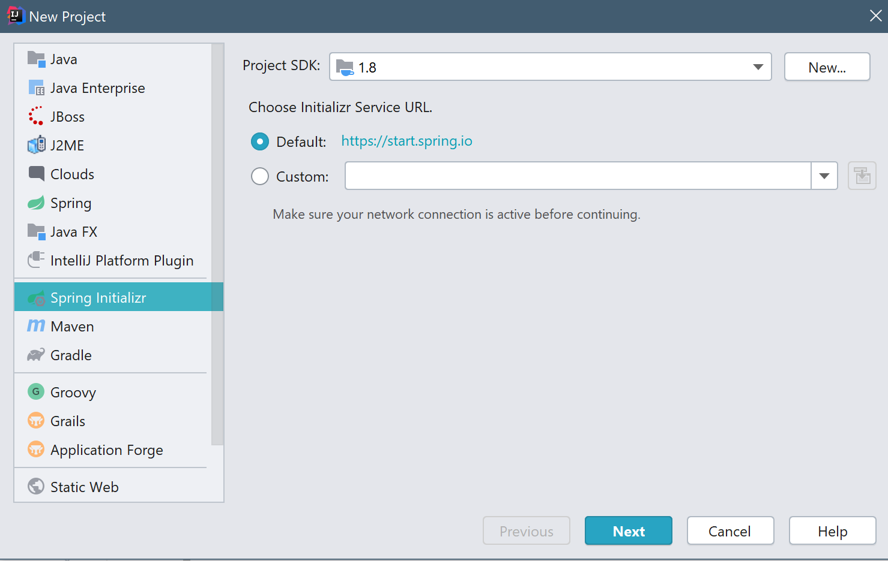
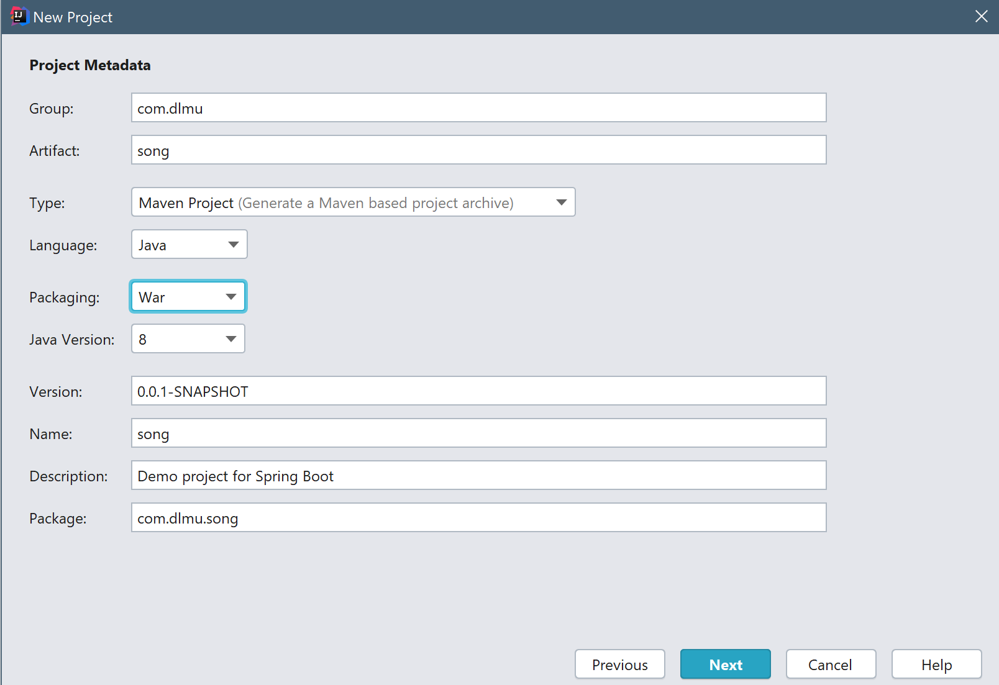
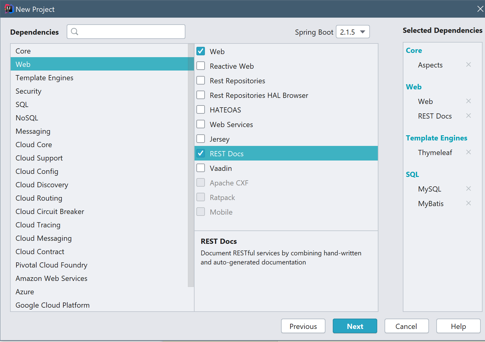
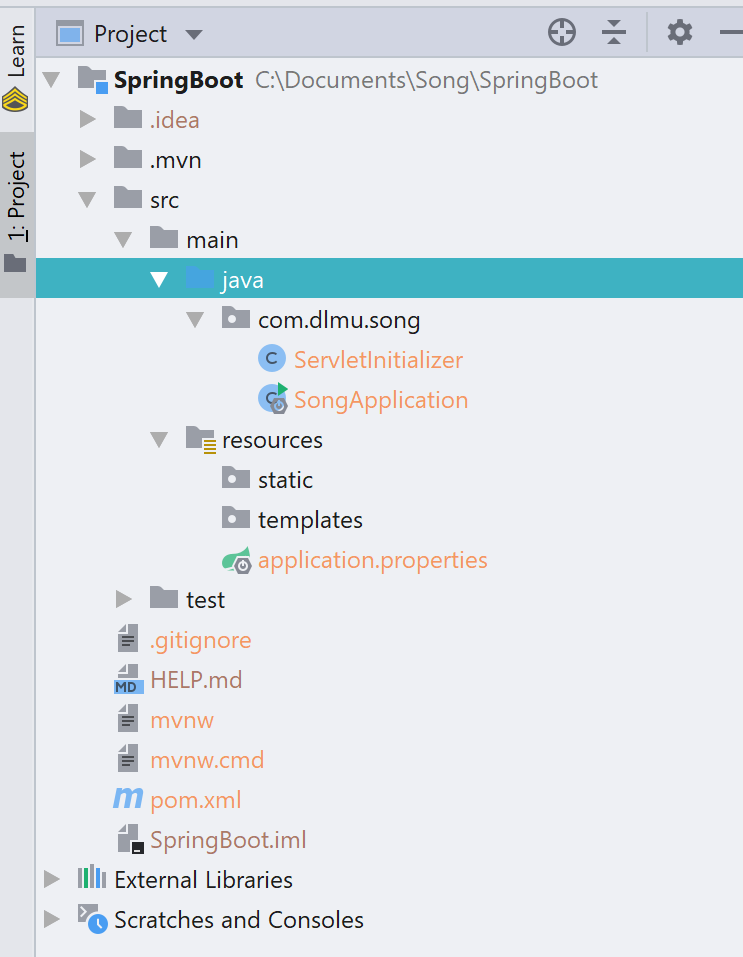
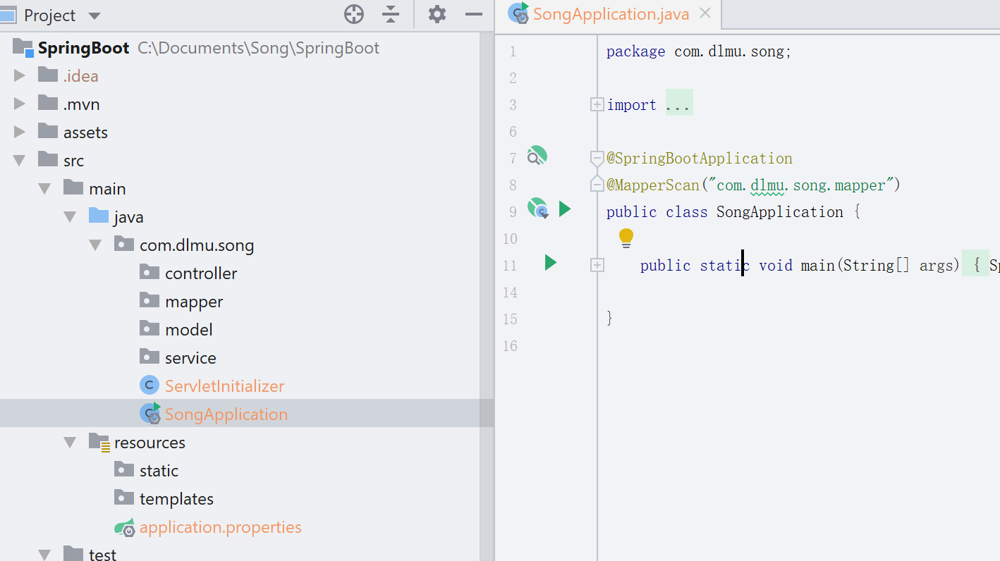
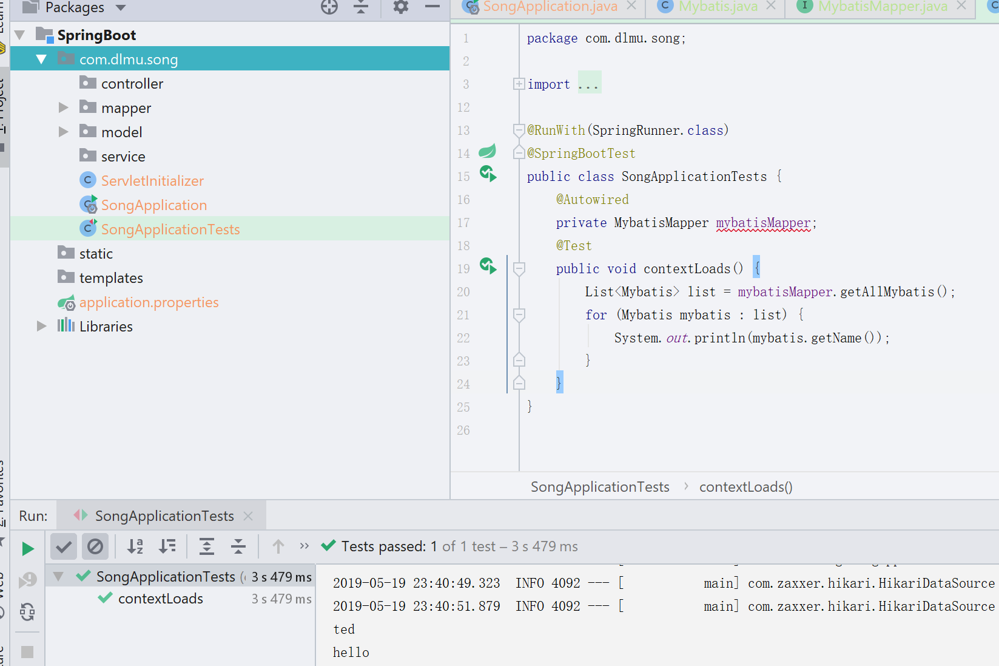
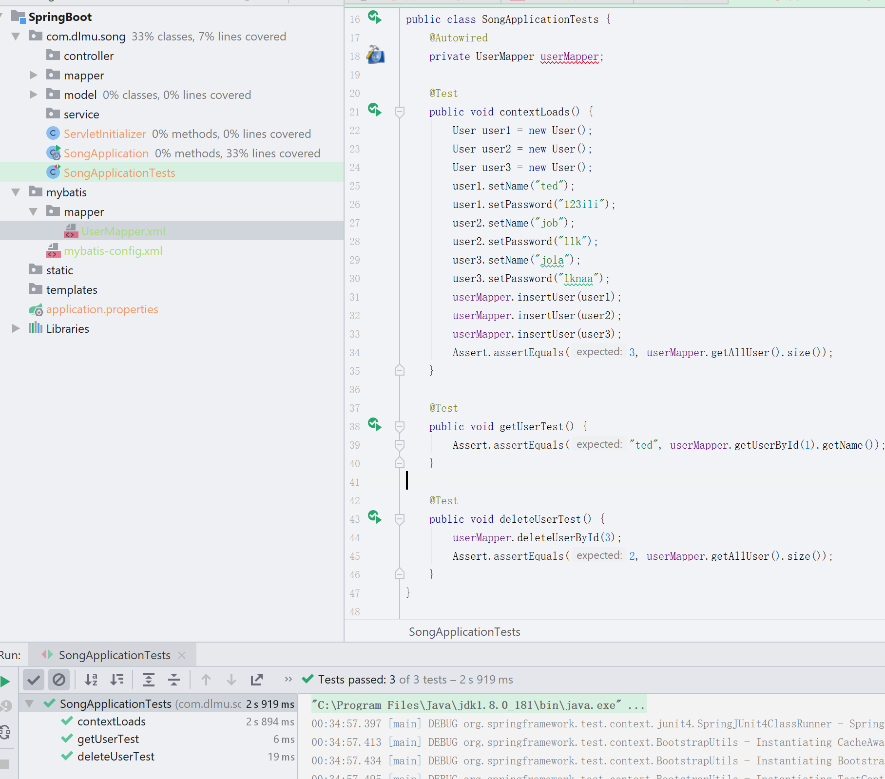

*今天就直接开始用最简单的spring boot编写一个web服务应用吧*

# SpringBoot

*简单介绍下*

SpringBoot的核心思想是约定大于配置,也就是说你只要按它约定俗成的一些东西,就可以很方便的简化很多配置上的东西.

Spring Boot实现了自动配置，降低了项目搭建的复杂度。

Spring框架需要进行大量的配置，Spring Boot引入自动配置的概念，根据它约定俗成可以减少很多配置上的东西.

而我们要写的是SpringMvc程序,SpringMvc是对Servlet的封装,Servlet就相当于之前学过的ASP.NET,而SpringMvc则是相当于我们用ASP.NET写了一套模板,后面再用的话只需要调用这个模板里的方法就可以了.

SpringMvc就是根据MVC设计模式然后利用Servlet写的这样一个模板,而通过SpringBoot我们可以减少很多SpringMvc配置上的东西.

## 创建项目

首先创建新项目吧,打开IDEA>New Project>Spring Initializr





修改packaging为war,其它的自定义就ok



目前就安装这几个依赖吧,thymeleaf待会会说是什么东西,REST Docs可以自动生成文档,在东软打工应该看到过很多别人写的API文档吧,可以自动生成类似那种东西的一个java工具,别的在前面的内容都写过了~

让我们看看创建好的目录是什么样子的~



大概就这样,其中resources中的application.properties是用来写配置的,static是用来放图片之类的前端资源的,templates是用来放类似html一类的模板的~

## 配置数据库

现在application.properties里写一些数据库连接之类的配置

```properties
# database
spring.datasource.url=jdbc:mysql://localhost:3306/mybatis?useUnicode=true&characterEncoding=utf-8&serverTimezone=UTC&useSSL=true
spring.datasource.username=root
spring.datasource.password=ilikeshe2
spring.datasource.driver-class-userName=com.mysql.cj.jdbc.Driver

# thymeleaf
spring.thymeleaf.cache=false
spring.thymeleaf.mode=HTML
spring.thymeleaf.encoding=UTF-8
```

其中spring.datasource.url是固定的,昨天我们用的是自己随便起的名字jdbc.url...之类的,但是springboot的话你只要按照它约定俗成的配置名称,它就会自动帮我们创建好datasource,就不用像昨天我们使用mybatis那样手动装配一个hikariCP的datasource,而springboot默认使用的数据库连接池就是hikari.

后面是配置thymeleaf,很熟悉的html23333,差不多thymeleaf就是一个html的拓展,类似jsp一样,不过比jsp要简单些,因为jsp里可以写java语句,而thymeleaf不可以.

我们现在看看如何使用Mybatis获取数据.

我们创建几个包,如图:



打开SongApplication类,添加上注解@Mapper("com.dlmu.song.mapper")

在model里编写数据模型

```java
public class Mybatis {
    private int id;
    private String userName;
    private int age;
    public int getId() {return id;}
    public void setId(int id) {this.id = id;}
    public String getName() {return userName;}
    public void setName(String userName) {this.userName = userName;}
    public int getAge() {return age;}
    public void setAge(int age) {this.age = age;}
}
```

在mapper包里新建一个接口类MybatisMapper

```java
@Repository
public interface MybatisMapper {
    @Select("select * from mybatis")
    List<Mybatis> getAllMybatis();
}
```

@Repository这个注解继承了@Component,算是一个语义化的@Component,就像@Configuration一样,语义化更强,但实际的作用都是一样的,都是让Spring容器帮我们管理该Bean...理解上就是这是一个仓库,我们可以从这个仓库里拿数据,比起单纯的打个@Component注解更容易让别人理解~

这样就完成了~是不是比昨天的简单很多呢?

然后编写测试,找到test包下的SongApplicationTests



mybatisMapper上有个错误提示,不去管它...

运行测试结果如图,里面打印了获取到的两个数据,现在用起来是不是很简单呢?

现在让我们写一个可以在网页里增删改查的案例吧~

## 使用Mybatis的XML

首先在数据库里创建表

```mysql
create table user(
id int auto_increment primary key,
userName varchar(255),
password varchar(255)
);
```

然后删掉刚才写的mapper和mybatis模型.重新写个user的模型.

```java
public class User {
    private int id;
    private String userName;
    private String password;
    //省略setter和getter
}
```

编写mapper,现在我们不使用java的注解来编写sql语句,mybatis比较强大的sql语句编写都是需要用xml的,一步一步照做就会用了~

我们先在mapper包下编写的mapper接口如下

```java
@Repository
public interface UserMapper {
    List<User> getAllUser();

    User getUserById(int id);

    void insertUser(User user);

    void deleteUserById(int id);

    void updateUser(User user);

    void deleteAllUser();
}
```


我们在resources目录下创建mybatis文件夹,新建一个文件,命名为mybatis-config.xml,复制粘贴以下内容

```xml
<?xml version="1.0" encoding="UTF-8" ?>
<!DOCTYPE configuration PUBLIC "-//mybatis.org//DTD Config 3.0//EN" "http://mybatis.org/dtd/mybatis-3-config.dtd">
<configuration>
    <typeAliases>
        <typeAlias alias="Integer" type="java.lang.Integer"/>
        <typeAlias alias="Long" type="java.lang.Long"/>
        <typeAlias alias="HashMap" type="java.util.HashMap"/>
        <typeAlias alias="LinkedHashMap" type="java.util.LinkedHashMap"/>
        <typeAlias alias="ArrayList" type="java.util.ArrayList"/>
        <typeAlias alias="LinkedList" type="java.util.LinkedList"/>
        <typeAlias alias="User" type="com.dlmu.song.model.User"/>
    </typeAliases>
</configuration>
```

这是一个mybatis的配置文件,其中typeAlias根据字面意思理解就是别名,给com.dlmu.song.model.User起了个别名叫User,在之后使用的时候就不需要输入包名了.

然后在mybatis包下创建一个mapper包,在其中创建一个UserMapper.xml,内容如下

```xml
<?xml version="1.0" encoding="UTF-8" ?>
<!DOCTYPE mapper
        PUBLIC "-//mybatis.org//DTD Mapper 3.0//EN"
        "http://mybatis.org/dtd/mybatis-3-mapper.dtd">
<mapper namespace="com.dlmu.song.mapper.UserMapper">
    <!-- resultMap标签可以自定义映射关系,如果不自定义的话表的column必须跟User的变量名相同
 		jdbcType就相当于Mysql里的数据类型
	-->
    <resultMap id="userMap" type="User">
        <id column="id" property="id" jdbcType="INTEGER"/>
        <result column="userName" property="userName" jdbcType="VARCHAR"/>
        <result column="password" property="password" jdbcType="VARCHAR"/>
    </resultMap>
    <!-- 利用select标签可以在里面写查询语句,id的值对应的UserMapper.java里的方法名字,目前这些都是		单表映射查询,resultMap的值就是刚才写的resultMap标签里的id,表示要使用我们自定义的映射关系 -->
    <select id="getAllUser" resultMap="userMap">
        SELECT *
        FROM USER
    </select>
    <!-- parameterType表示我们传入值的类型 -->
    <select id="getUserById" resultMap="userMap" parameterType="Integer">
        SELECT *
        FROM USER
        WHERE ID = #{id}
    </select>
    <!-- 因为我们配置了alias,所以不需要写User的全路径com.dlmu.song.model.User -->
    <insert id="insertUser" parameterType="User">
        INSERT INTO USER(userName, password)
        VALUES (#{userName}, #{password})
    </insert>
    <update id="updateUser" parameterType="User">
        UPDATE user
        SET
        <!-- 用if标签可以测试是否要添加该sql语句的字符串,记得末尾加逗号,就跟平常写sql语句是一样的 -->
        <if test="userName != null">userName=#{userName},</if>
        <if test="password != null">password=#{password},</if>
        WHERE id = #{id}
    </update>
    <delete id="deleteUserById" parameterType="Integer">
        DELETE
        FROM user
        WHERE ID = #{id}
    </delete>
    <delete id="deleteAllUser">
        DELETE FROM USER
    </delete>
</mapper>
```

根据不同的标签写不同的SQL语句,Mybatis会根据这些标签来处理映射和数据查询,你可以先只写一个查询之类的试试看~

在application.properties里增加mybatis的配置搜索~

```properties
#mybatisConfig
mybatis.config-location=classpath:mybatis/mybatis-config.xml
mybatis.mapper-locations=classpath:mybatis/mapper/*.xml
```

就是刚才这两个xml的路径.

然后编写测试试试看~

```java
public class SongApplicationTests {
    @Autowired
    private UserMapper userMapper;

    @Test
    public void contextLoads() {
        User user1 = new User();
        User user2 = new User();
        User user3 = new User();
        user1.setName("ted");
        user1.setPassword("123ili");
        user2.setName("job");
        user2.setPassword("llk");
        user3.setName("jola");
        user3.setPassword("lknaa");
        userMapper.insertUser(user1);
        userMapper.insertUser(user2);
        userMapper.insertUser(user3);
        Assert.assertEquals(3, userMapper.getAllUser().size());
    }

    @Test
    public void getUserTest() {
        Assert.assertEquals("ted", userMapper.getUserById(1).getName());
    }

    @Test
    public void deleteUserTest() {
        userMapper.deleteUserById(3);
        Assert.assertEquals(2, userMapper.getAllUser().size());
    }
}
```



运行测试三个都通过了~证明我们用xml写的sql语句成功映射了,今天就写这些吧~明天开始写控制器,将获取到的数据response到页面上~

Mybatis还有别的用法很多很多...具体的在随后慢慢添加吧~还是很简单的,属于记忆性的东西...用一两次就能记住了~

下一篇开始写Thymeleaf