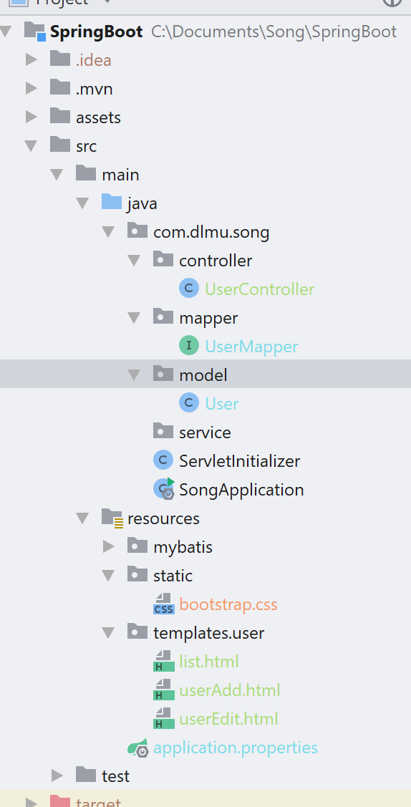
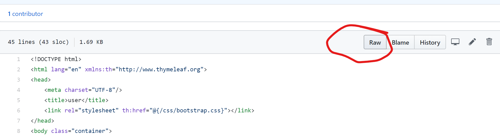
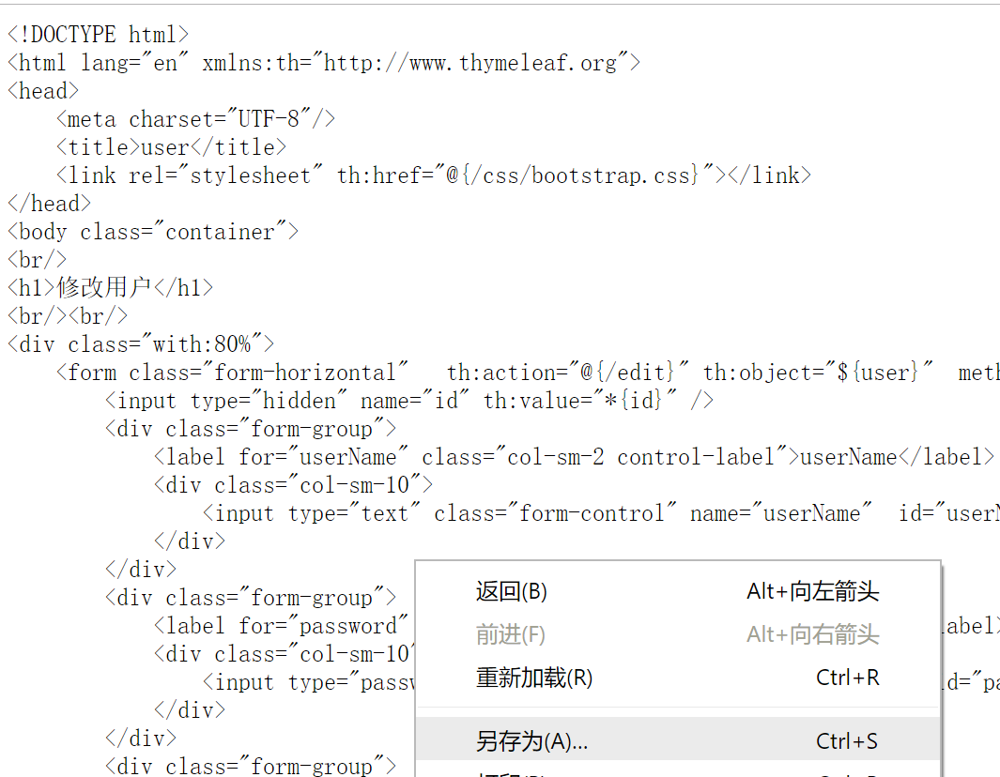
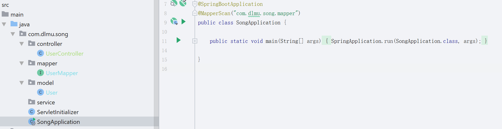
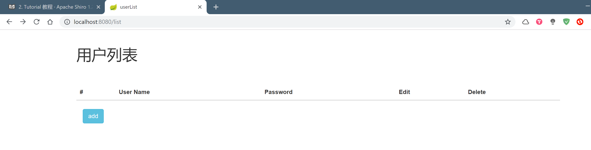

*今天做一个简单的增删改查的页面吧~*

首先我们在controller包下创建一个UserController,编写以下内容

```java
//注明该类是一个控制器类,收到的所有request会分发给@Controller类处理
@Controller
public class UserController {
    @Autowired
    UserMapper userMapper;
	//访问localhost:8080/的时候会转到RequestMapping为"/list"的方法进行处理请求 
    @RequestMapping("/")
    public String index() {
        return "redirect:/list";
    }

    @RequestMapping("/list")
    public String list(Model model) {
        //利用usermapper获取到数据库的所有user,然后添加到model里
        List<User> users = userMapper.getAllUser();
        //model.addAttribute有两个参数,以键值对的形式,第一个为键,第二个为值,前端部分可以通过键来获取到值.
        model.addAttribute("users", users);
        //return的这个表示跳转到resources/templates/user/list.html的页面,resources/templates和.html会自动添加到return的字符串上,所以我们只需要添加中间那部分user/list就可以
        return "user/list";
    }

    @RequestMapping("toAdd")
    public String toAdd() {
        //访问resources/templates/user/userAdd.html页面
        return "user/userAdd";
    }

    @RequestMapping("/add")
    public String add(User user) {
        userMapper.insertUser(user);
        //插入完用户后跳转到/list方法来处理请求
        return "redirect:/list";
    }

    @RequestMapping("/toEdit")
    public String toEdit(Model model, int id) {
        User user = userMapper.getUserById(id);
        model.addAttribute("user", user);
        //将该user添加到model里,然后访问user/userEdit.html页面
        return "user/userEdit";
    }

    @RequestMapping("/edit")
    public String edit(User user) {
        userMapper.updateUser(user);
        //同上上
        return "redirect:/list";
    }

    @RequestMapping("/delete")
    public String delete(int id) {
        userMapper.deleteUserById(id);
        //删除用户后由/list方法处理请求
        return "redirect:/list";
    }
}
```

由于代码很长,所以直接看里面的注释吧~在下面逐句解释的话还得再copy一点点代码,有些占空间.

然后我们在resources/templates下创建user包,在里面创建三个页面,分别为list.html,userAdd.html,userEdit.html,对应以上代码请求访问的三个页面名称.

现在我们的工程目录如下



static目录下的bootstrap.css是前端的一个css库...百度就有这个文件,你也可以从该github上找到这个文件,点击raw然后右键保存网页放到这里,不添加也没什么影响,单纯为了页面好看点而已.



我们再编写list.html中的内容

```html
<!DOCTYPE html>
<!-- 第一句跟普通的html有区别,我们需要添加上xmlns:th="http://www.thymeleaf.org",然后我们就可以使用thymeleaf模板引擎提供给我们的一些语法糖一样的东西 -->
<html lang="en" xmlns:th="http://www.thymeleaf.org">
<head>
    <meta charset="UTF-8"/>
    <title>userList</title>
    <link rel="stylesheet" th:href="@{/bootstrap.css}"/>
</head>
<body class="container">
<br/>
<h1>用户列表</h1>
<br/><br/>
<div class="with:80%">
    <table class="table table-hover">
        <thead>
        <tr>
            <th>#</th>
            <th>User Name</th>
            <th>Password</th>
            <th>Edit</th>
            <th>Delete</th>
        </tr>
        </thead>
        <tbody>
            <!-- th:each算是一个语法糖,它会遍历再${users}中的数据,${}中的数据是响应过来的model,之前我们不是说由键值对的形式保存的吗?所以users就是键,访问到我们保存在里面的List<User> -->
        <tr th:each="user : ${users}">
            <th scope="row" th:text="${user.id}">1</th>
            <td th:text="${user.userName}">neo</td>
            <td th:text="${user.password}">Otto</td>
            <!-- 利用a标签进行请求,请求会由controller进行处理,其中的(id=${user.id})就是传递给controller的参数 -->
            <td><a th:href="@{/toEdit(id=${user.id})}">edit</a></td>
            <td><a th:href="@{/delete(id=${user.id})}">delete</a></td>
        </tr>
        </tbody>
    </table>
</div>
<div class="form-group">
    <div class="col-sm-2 control-label">
        <a href="/toAdd" th:href="@{/toAdd}" class="btn btn-info">add</a>
    </div>
</div>
</body>
</html>
```

然后是userAdd.html

```html
<!DOCTYPE html>
<html lang="en" xmlns:th="http://www.thymeleaf.org">
<head>
    <meta charset="UTF-8"/>
    <title>user</title>
    <link rel="stylesheet" th:href="@{/bootstrap.css}"/>
</head>
<body class="container">
<br/>
<h1>添加用户</h1>
<br/><br/>
<div class="with:80%">
    <!-- 通过表单的请求将数据传递给controller里由RequestMapping("/add")标注的方法,由该方法进行请求的处理 -->
    <form class="form-horizontal" th:action="@{/add}" method="post">
        <div class="form-group">
            <label for="userName" class="col-sm-2 control-label">userName</label>
            <div class="col-sm-10">
                <!-- id对应的是user的中的变量名称 -->
                <input type="text" class="form-control" name="userName" id="userName" placeholder="userName"/>
            </div>
        </div>
        <div class="form-group">
            <label for="password" class="col-sm-2 control-label">Password</label>
            <div class="col-sm-10">
                <input type="password" class="form-control" name="password" id="password" placeholder="Password"/>
            </div>
        </div>
        <div class="form-group">
            <div class="col-sm-offset-2 col-sm-10">
                <input type="submit" value="Submit" class="btn btn-info"/>
                &nbsp; &nbsp; &nbsp;
                <input type="reset" value="Reset" class="btn btn-info"/>
            </div>
        </div>
    </form>
</div>
</body>
</html>
```

userEdit.html

```html
<!DOCTYPE html>
<html lang="en" xmlns:th="http://www.thymeleaf.org">
<head>
    <meta charset="UTF-8"/>
    <title>user</title>
    <link rel="stylesheet" th:href="@{/bootstrap.css}"/>
</head>
<body class="container">
<br/>
<h1>修改用户</h1>
<br/><br/>
<div class="with:80%">
    <form class="form-horizontal" th:action="@{/edit}" th:object="${user}" method="post">
        <input type="hidden" name="id" th:value="*{id}"/>
        <div class="form-group">
            <label for="userName" class="col-sm-2 control-label">userName</label>
            <div class="col-sm-10">
                <input type="text" class="form-control" name="userName" id="userName" th:value="*{userName}"
                       placeholder="userName"/>
            </div>
        </div>
        <div class="form-group">
            <label for="password" class="col-sm-2 control-label">Password</label>
            <div class="col-sm-10">
                <input type="password" class="form-control" name="password" id="password" th:value="*{password}"
                       placeholder="Password"/>
            </div>
        </div>
        <div class="form-group">
            <div class="col-sm-offset-2 col-sm-10">
                <input type="submit" value="Submit" class="btn btn-info"/>
                &nbsp; &nbsp; &nbsp;
                <a href="/toAdd" th:href="@{/list}" class="btn btn-info">Back</a>
            </div>

        </div>
    </form>
</div>
</body>
</html>
```

我们可以看到大部分都是跟普通的html相差无二的,就是标签里有一些th:的属性,该属性会由thymeleaf进行处理,然后渲染成普通的html,这种将特殊的语法渲染成普通的html就是所谓的模板引擎

该引擎的更多语法糖就百度自己找找吧~不过现在已经很少用这些了...基本就是用前后端分离的那一套了,我介绍这个只是想让你对后端有一个整体的了解...

这样子会让前后端有很高的耦合,如果你修改了model里的键可能前端就没法正确获取到值了,而且前后端的开发进度互相都会有很大的影响,当然如果一个人做全栈的话这样写反而效率可能会更高...不过后期维护也不是很容易就是了~

然后运行应用,



点击类左边的绿色小箭头运行,然后我们打开浏览器输入localhost:8080



这样就算完成了~

可以试试增删改查之类的操作,如果有问题你可以将自己写的代码跟我上传到github上的对比对比看看

这里虽然没什么难度,不过代码量还是不算特别少了...写熟练了就很简单了~

明天的话会写SpringDataJpa,一个完善的ORM映射框架,然后是Servlet的使用,看看最原始的时候是怎么使用Java进行后端的开发,学会Servlet和SpringMvc能更好得理解SpringBoot...

了解完这些应用再开始写一些别的基础上的东西...比如设计模式,还有java一些特别的语法糖和概念

自顶向下得写文档方式~写完了也可以自底向上看吧2333333