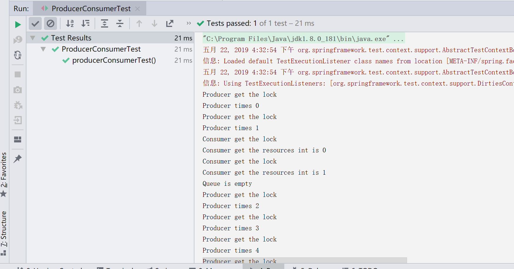

# 生产者消费者

*上学期操作系统在linux上用c语言编写过生产者消费者来着,现在用java试一试吧~可以感受到要比c语言简单很多...*

## 线程

线程的五个状态

1. 新建New
2. 就绪Runnable
3. 运行Running
4. 阻塞Blocked
5. 死亡Dead

## 创建多线程的方式.

1. 继承Thread类并重写run方法

```java
public class MyThread extend Thread{
    @Override
    public void run(){
        //do something
    }
}
public class Main{
    public static void main(String[] args){
        MyThread thread = new MyThread();
        thread.start();
    }
}
```

run方法中写你想要该线程做的事情.

创建线程后用start()将线程放在就绪队列中,进入就绪状态,即获取到了除了CPU以外的所有资源.

当前占用CPU的线程进入阻塞状态空出来CPU资源的时候就会轮到该线程去运行Running.

2. 实现Runnable接口

```java
public class RunnableTask implements Runnable{
    @Override
    public void run(){
        //do something
    }
}
public class Main{
    public static void main(String[] args){
        Thread thread = new Thread(new RunnableTask);
        thread.start();
    }
}
```

使用Runnable的好处就是该class可以用extends关键字继承别的类,而因为java类是不支持多继承的,所以使用上面的第一种方法的话就除了Thread以外不能继承别的类了.java可以实现多个接口,而不能继承多个类.

3. 上面两个方法创建的线程都没有返回值,当我们需要用到线程运行完后的结果时就需要使用第三种方法来创建线程.继承Callable<>接口,<>中的为泛型,在这里就是想要返回的值类型.

```java
public class CallerTask implements Callable<String>{
    @Override
    public String call() throws Exception{
        return "hello";
    }
}
public class Main{
    public static void main(String[] args){
        FutureTask<String> futureTask = new FutureTask<>(new CallerTask());
        new Thread(futureTask).start();
        try{
            String result = futureTask.get();
        }catch(ExecutionException e){
            //如果运行出错的话就打印在栈顶的类所抛出的异常信息.
            //目前理解成System.out.println("异常信息")这样子就可以了.
            e.printStackTrace();
        }
    }
}
```

FutureTask是一个异步任务,从类名Future就可以看出来这是一个将要执行的task,在start()之后通过get获取线程运行结束后的结果

## 生产者消费者

还记得上学期的内容的话,可以记起来我们在运行一个线程的时候需要加锁,结束后需要释放锁并且通知其它进程我们的活干完了.

所以synchronized就是一个表现上用来加锁的关键字,然后使用wait()方法挂起该进程并释放锁,然后通过notifyAll()通知其它线程...我记得上学期操作系统用的是信号量来唤醒其它进程来着...

```java
//大概就像这样
//生产者
synchronized(queue){
    while(queue.size()==MAX){
        try{
            //挂起并释放锁
            queue.wait();
        }catch(Exception ex){
            ex.printStackTrace();
        }
    }
    //如果队列不为满,就在里面增加元素.
    queue.add(element);
    //唤醒其他线程
    queue.notifyAll();
}
//消费者
synchronized(queue){
    //如果队列为空就挂起
    while(queue.size()!=0){
        try{
            queue.wait();
        }catch(Exception ex){
            ex.printStackTrace();
        }
    }
    //拿走队列中的元素
    queue.take();
    queue.notifyAll();
}
```

synchronized()中的值为共享变量,就是这几个线程公共使用的一个资源,你用的时候我不能用,我用的时候你不能用.

思路就是这样子的,上面的算是伪代码,实际写一下看看吧~

首先创建一个ProducerConsumer类

```java
public class ProducerConsumer {
    //设置队列的最大存储
    final static int MAX_SIZE = 5;
    //实例化一个队列对象,队列是Java自带的一个数据结构类,不需要我们实现.
    final static Queue<Integer> queue = new LinkedList<>();
    //生产者生产了多少次.
    static int times = 0;
    //程序入口
    public static void main(String[] args){
        Thread pro = new Thread(new Producer());
        Thread con = new Thread(new Consumer());
        pro.start();
        con.start();
    }
}
```

为什么使用final?final在java中是用来定义常量的,常量指的是引用为常量,引用差不多可以理解为指针,就是说该实例不能指向其他实例,但是如果该实例为一个容器的话,该容器里存储的值是可以更改的.

就是说,用final修饰的变量如果是一个盒子的话,盒子里可以随便装什么东西,但是你不能换个盒子,而没有用final修饰的变量就是说你可以随便换什么盒子都可以.因为我们想用该队列作为加锁的共享变量,所以你不能换一把锁对吧?所以设置为final

而static修饰的值是静态变量,意思就是不用实例化就可以直接使用,举个例子吧

```java
public class Test1{
    int a = 5;
}
public class Test2{
    static int a = 5;
}
public class Main{
    int a = new Test1().a;
    int b = Test2.a;
}
```

看出来区别了吗?

现在我们写个生产者

```java
//将静态变量导入,就不用写一长串来使用了
import static com.dlmu.song.ProducerConsumer.ProducerConsumer.queue;
import static com.dlmu.song.ProducerConsumer.ProducerConsumer.times;
import static com.dlmu.song.ProducerConsumer.ProducerConsumer.MAX_SIZE;

public class Producer implements Runnable {
    @Override
    public void run() {
        //do{}while()语法,作用是不管while()中为真为假,都会运行一次do{}中的内容
        do {
            //对queue进行加锁
            synchronized (queue) {
                //队列满了的话
                while (queue.size() == MAX_SIZE) {
                    try {
                        //输出队列为max,然后挂起该线程,并释放queue资源
                        System.out.println("Queue is max");
                        queue.wait();
                    } catch (InterruptedException e) {
                        e.printStackTrace();
                    }
                }
                System.out.println("Producer get the lock");
                System.out.println("Producer times " + times);
                //offer方法为向队列尾部增加元素,times++表示该方法运行结束后自增1
                queue.offer(times++);
                //唤醒其它线程
                queue.notifyAll();
            }
        } while (times < 20);
    }
}
```

然后是消费者

```java
import static com.dlmu.song.ProducerConsumer.ProducerConsumer.queue;

public class Consumer implements Runnable {

    @Override
    public void run() {
        //用该变量来判断是否应该停止循环,当生产者的times增加到20的时候就不再运行该线程了
        Integer time;
        do {
            //获取queue资源,对queue加锁
            synchronized (queue) {
                //队列为空的话就释放锁
                while (queue.size() == 0) {
                    try {
                        System.out.println("Queue is empty");
                        queue.wait();
                    } catch (InterruptedException e) {
                        e.printStackTrace();
                    }
                }
                System.out.println("Consumer get the lock");
                //poll()就是队列中的dequeue,名字不一样而已,在java里叫poll(),删除并返回队列首部的元素
                time = queue.poll();
                System.out.println("Consumer get the resources int is " + time);
                //唤醒其他线程
                queue.notifyAll();
            }
        } while (time != null && time < 20);
    }
}
```

然后点击public static void main()方法左边的箭头运行试试




嗯到这里生产者消费者用java就写完了...比起c语言要简单很多了~